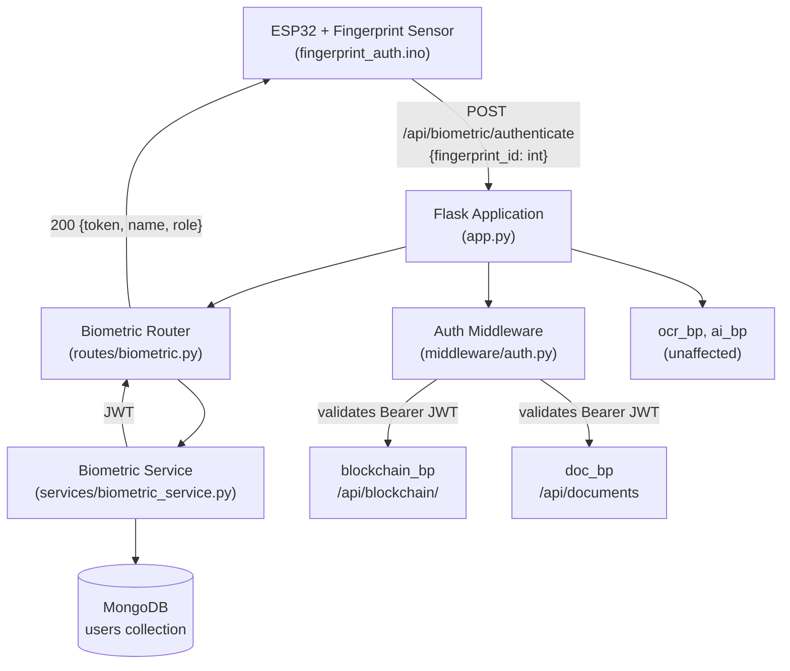

# Design Document: Biometric Authentication

## Overview

This document describes the technical design for adding fingerprint-based authentication to the existing Flask Legal Document Management System. The feature is entirely additive — no existing code (OCR pipeline, blockchain service, AI models, or blueprints) is modified.

The authentication flow works as follows:

1. An ESP32 microcontroller polls a connected fingerprint sensor. When a finger is placed and matched, it sends the integer `fingerprint_id` to the Flask backend over WiFi via HTTP POST.
2. The Flask `Biometric_Router` looks up the `fingerprint_id` in MongoDB's `users` collection via the `Biometric_Service`.
3. On a successful match, `Biometric_Service` generates a signed JWT (PyJWT, 1-hour expiry) containing `user_id`, `name`, and `role` claims.
4. The JWT is returned to the caller (ESP32 or any HTTP client). Subsequent requests to protected routes (`/api/blockchain/` and `/api/documents`) must include this JWT in the `Authorization: Bearer <token>` header.
5. `Auth_Middleware` enforces this requirement on those two URL prefixes only, leaving all other routes untouched.

---

## Architecture



### Key Design Decisions

- **Additive only**: `app.py` gains two lines (blueprint registration + middleware hookup) and no existing code changes.
- **PyJWT for token signing**: Already available in Python ecosystem; no new heavy dependencies. Secret key is read from `JWT_SECRET` environment variable with a secure fallback.
- **No enrollment in scope**: Fingerprints are pre-enrolled on the sensor hardware. The backend has no enrollment endpoint.
- **Middleware scope is explicit**: `Auth_Middleware` uses Flask's `before_request` hook filtered by `request.path.startswith(...)` so it is precise and does not require wrapping individual blueprints.
- **Profile endpoint is JWT-only**: User identity for `/api/biometric/profile` is derived entirely from decoded JWT claims — no secondary MongoDB lookup — keeping the endpoint fast and stateless.

---

## Components and Interfaces

### 1. ESP32 Firmware (`esp32/fingerprint_auth.ino`)

Responsibilities:
- Initialize `HardwareSerial Serial2` at 57600 baud (RX2=GPIO16, TX2=GPIO17)
- Connect to WiFi using `WiFi.begin(ssid, password)`
- Initialize the Adafruit Fingerprint sensor on `Serial2`
- Poll continuously: `finger.getImage()` → `finger.image2Tz()` → `finger.fingerSearch()`
- On successful match: HTTP POST to `http://<FLASK_HOST>:5050/api/biometric/authenticate` with body `{"fingerprint_id": <int>}`
- On no match: print to serial monitor, continue polling
- Print full HTTP response body to serial monitor

Dependencies: `WiFi.h`, `HTTPClient.h`, `Adafruit_Fingerprint.h`

### 2. Biometric Service (`backend/services/biometric_service.py`)

Public interface:

```python
def register_user(name: str, fingerprint_id: int, role: str) -> dict:
    """Insert a new user document. Returns the document with generated user_id.
    Raises ValueError if fingerprint_id already exists."""

def authenticate_fingerprint(fingerprint_id: int) -> dict | None:
    """Look up user by fingerprint_id. Returns user dict or None."""

def generate_access_token(user_id: str, name: str, role: str) -> str:
    """Generate a signed JWT with 1-hour expiry."""

def verify_token(token: str) -> dict:
    """Decode and validate JWT. Returns claims dict.
    Raises jwt.ExpiredSignatureError or jwt.InvalidTokenError on failure."""
```

Internal details:
- `user_id` is generated with `str(uuid.uuid4())`
- JWT is signed with `HS256` algorithm using secret from `os.environ.get("JWT_SECRET", "change-me-in-production")`
- JWT claims: `{"user_id": ..., "name": ..., "role": ..., "exp": datetime.utcnow() + timedelta(hours=1)}`
- MongoDB access via `from models.document import db`; collection is `db["users"]`

### 3. Biometric Router (`backend/routes/biometric.py`)

Endpoints:

| Method | Path | Auth required | Description |
|--------|------|---------------|-------------|
| POST | `/api/biometric/register` | No | Register a new user with fingerprint_id |
| POST | `/api/biometric/authenticate` | No | Authenticate by fingerprint_id, receive JWT |
| GET | `/api/biometric/profile` | Yes (Bearer JWT) | Return profile from JWT claims |

```python
biometric_bp = Blueprint("biometric", __name__)
```

### 4. Auth Middleware (`backend/middleware/auth.py`)

```python
def init_auth(app: Flask) -> None:
    """Register the before_request hook on the Flask app.
    Only enforces auth for paths starting with /api/blockchain/ or /api/documents."""

def require_auth() -> tuple | None:
    """before_request handler. Returns (jsonify({error}), 401) or None to proceed."""
```

Implementation approach:

```python
PROTECTED_PREFIXES = ("/api/blockchain/", "/api/documents")

@app.before_request
def _auth_guard():
    if not request.path.startswith(PROTECTED_PREFIXES):
        return None   # not protected, let it through
    auth_header = request.headers.get("Authorization", "")
    if not auth_header.startswith("Bearer "):
        return jsonify({"error": "Authorization header missing or malformed"}), 401
    token = auth_header[len("Bearer "):]
    try:
        g.current_user = verify_token(token)
    except Exception:
        return jsonify({"error": "Invalid or expired token"}), 401
    return None
```

The decoded claims are stored in `flask.g.current_user` for downstream handlers to use if needed.

### 5. App Registration (`backend/app.py` additions only)

Two lines are added after the existing blueprint registrations:

```python
from routes.biometric import biometric_bp
from middleware.auth import init_auth

app.register_blueprint(biometric_bp, url_prefix="/api/biometric")
init_auth(app)
```

No existing lines are modified or removed.

---

## Data Models

### MongoDB `users` Collection

Each document has the following schema:

```json
{
  "user_id":       "550e8400-e29b-41d4-a716-446655440000",
  "name":          "Alice Sharma",
  "fingerprint_id": 3,
  "role":          "lawyer"
}
```

Field constraints:
- `user_id`: UUID4 string, generated server-side, unique
- `name`: non-empty string
- `fingerprint_id`: positive integer, unique (index enforced)
- `role`: non-empty string (e.g., `"admin"`, `"lawyer"`, `"clerk"`)

Recommended index (created at startup or lazily):

```python
db["users"].create_index("fingerprint_id", unique=True)
db["users"].create_index("user_id", unique=True)
```

### JWT Payload

```json
{
  "user_id": "550e8400-e29b-41d4-a716-446655440000",
  "name":    "Alice Sharma",
  "role":    "lawyer",
  "exp":     1720000000
}
```

`exp` is a Unix timestamp set to `utcnow() + 3600 seconds` at token generation time.

---

## Correctness Properties

*A property is a characteristic or behavior that should hold true across all valid executions of a system — essentially, a formal statement about what the system should do. Properties serve as the bridge between human-readable specifications and machine-verifiable correctness guarantees.*

**Property Reflection**: After reviewing all testable criteria from the prework, several were consolidated:
- 3.2, 3.3, 3.4 (JWT claims, expiry, HTTP 200) are all aspects of the authenticate round-trip; merged into Property 3.
- 4.2 (verify returns claims) is subsumed by 4.5 (round-trip); the round-trip property (Property 4) covers both.
- 5.2, 5.4 (401 on missing/invalid JWT) are two sides of the same middleware rejection property; merged into Property 6.
- 6.1 (profile returns claims) and 6.2 (profile rejects bad JWT) map cleanly to Properties 7 and 6 respectively.

---

### Property 1: Registration stores correct document schema

*For any* valid combination of `name` (non-empty string), `fingerprint_id` (positive integer), and `role` (non-empty string), registering a user via `register_user` SHALL produce a document stored in the `users` collection that contains exactly the fields `user_id`, `name`, `fingerprint_id`, and `role`, where `name`, `fingerprint_id`, and `role` match the input exactly.

**Validates: Requirements 2.1, 2.5**

---

### Property 2: Registration generates unique user IDs

*For any* sequence of N distinct `fingerprint_id` values used in N separate `register_user` calls, all N returned `user_id` values SHALL be distinct strings.

**Validates: Requirements 2.4**

---

### Property 3: Duplicate fingerprint_id is rejected with 409

*For any* `fingerprint_id` that has already been registered in the `users` collection, a subsequent call to `POST /api/biometric/register` with the same `fingerprint_id` SHALL return HTTP 409.

**Validates: Requirements 2.3**

---

### Property 4: Missing required registration fields return 400

*For any* non-empty strict subset of the required registration fields (`name`, `fingerprint_id`, `role`) that is omitted from a `POST /api/biometric/register` request, the router SHALL return HTTP 400.

**Validates: Requirements 2.2**

---

### Property 5: Authentication round-trip preserves claims and respects expiry

*For any* registered user with `(user_id, name, role, fingerprint_id)`, calling `POST /api/biometric/authenticate` with that `fingerprint_id` SHALL return HTTP 200 with a JWT whose decoded claims contain the same `user_id`, `name`, and `role`, and whose `exp` claim equals `iat + 3600` seconds (within a tolerance of ±2 seconds).

**Validates: Requirements 3.1, 3.2, 3.3, 3.4**

---

### Property 6: Authentication returns 404 for unregistered fingerprint IDs

*For any* integer `fingerprint_id` that does not exist in the `users` collection, calling `POST /api/biometric/authenticate` with that `fingerprint_id` SHALL return HTTP 404.

**Validates: Requirements 3.5**

---

### Property 7: JWT generate/verify round-trip preserves all claims

*For any* triple `(user_id, name, role)` of non-empty strings, calling `generate_access_token(user_id, name, role)` and then immediately calling `verify_token` on the result SHALL return a claims dictionary containing `user_id`, `name`, and `role` values identical to the inputs, and the token SHALL not be considered expired.

**Validates: Requirements 4.2, 4.5**

---

### Property 8: Tokens signed with wrong key are rejected

*For any* valid claims triple `(user_id, name, role)`, encoding a JWT with a key different from the application secret and calling `verify_token` on that token SHALL raise an exception (invalid signature).

**Validates: Requirements 4.4**

---

### Property 9: Protected routes reject all requests without valid JWT

*For any* URL path that starts with `/api/blockchain/` or `/api/documents`, a request that either (a) omits the `Authorization` header entirely, or (b) provides an expired or tampered JWT in the `Authorization` header, SHALL receive HTTP 401 from the auth middleware.

**Validates: Requirements 5.2, 5.4**

---

### Property 10: Protected routes pass requests with valid JWT

*For any* URL path under `/api/blockchain/` or `/api/documents`, a request that carries a valid, non-expired JWT in the `Authorization: Bearer <token>` header SHALL be passed through the middleware to the route handler (i.e., the middleware does not return 401).

**Validates: Requirements 5.3, 5.6**

---

### Property 11: Unprotected routes are never blocked by auth middleware

*For any* URL path that does NOT start with `/api/blockchain/` or `/api/documents` (e.g., paths under `/api/ocr` or `/api/ai`), a request without an `Authorization` header SHALL NOT receive HTTP 401 from the auth middleware.

**Validates: Requirements 5.5, 7.2**

---

### Property 12: Profile endpoint returns JWT claims without DB lookup

*For any* valid JWT containing non-empty `(user_id, name, role)` claims, a `GET /api/biometric/profile` request bearing that JWT SHALL return HTTP 200 with a JSON body containing `user_id`, `name`, and `role` equal to those claims, with no query issued to the `users` MongoDB collection.

**Validates: Requirements 6.1, 6.3**

---

## Error Handling

| Scenario | Component | HTTP Status | Response body |
|----------|-----------|-------------|---------------|
| Missing required field in register | Biometric Router | 400 | `{"error": "Missing required fields: <fields>"}` |
| Duplicate `fingerprint_id` in register | Biometric Router | 409 | `{"error": "fingerprint_id already registered"}` |
| Missing `fingerprint_id` in authenticate | Biometric Router | 400 | `{"error": "fingerprint_id is required"}` |
| `fingerprint_id` not found in DB | Biometric Router | 404 | `{"error": "Fingerprint not registered"}` |
| Missing `Authorization` header | Auth Middleware | 401 | `{"error": "Authorization header missing or malformed"}` |
| Expired JWT | Auth Middleware | 401 | `{"error": "Invalid or expired token"}` |
| Invalid JWT signature | Auth Middleware | 401 | `{"error": "Invalid or expired token"}` |
| MongoDB connection failure during register | Biometric Service | 500 | `{"error": "Internal server error"}` |
| MongoDB connection failure during authenticate | Biometric Service | 500 | `{"error": "Internal server error"}` |

All error responses use the consistent `{"error": "<message>"}` shape already used by existing routes in the codebase (see `blockchain.py` and `documents.py`).

---

## Testing Strategy

### Property-Based Testing (Hypothesis)

The project already uses Hypothesis (see `.hypothesis/` directory and existing test files). The biometric feature's correctness properties are well-suited for PBT: the core logic (JWT generation/verification, user registration, middleware enforcement) is pure or near-pure Python with clearly bounded inputs.

Each property test MUST run a minimum of 100 iterations. Each test is tagged with a comment referencing the design property it validates.

**Tag format**: `# Feature: biometric-authentication, Property <N>: <property_text>`

Target file: `IDP/backend/tests/test_biometric_auth.py`

#### Properties to implement as Hypothesis tests

| Design Property | Test strategy |
|-----------------|---------------|
| Property 1 (registration schema) | `@given(name=text(min_size=1), fingerprint_id=integers(min_value=1), role=text(min_size=1))` — register and assert stored doc fields |
| Property 2 (unique user IDs) | `@given(st.lists(integers(min_value=1), min_size=2, unique=True))` — register all, assert all user_ids distinct |
| Property 3 (duplicate fingerprint 409) | `@given(integers(min_value=1))` — register once, register again, assert 409 |
| Property 4 (missing fields → 400) | `@given(st.frozensets(st.sampled_from(["name","fingerprint_id","role"]), min_size=1))` — omit each subset, assert 400 |
| Property 5 (authenticate round-trip) | `@given(...)` — register user, authenticate, decode JWT, compare claims and exp |
| Property 6 (unregistered → 404) | `@given(integers(min_value=1000))` — authenticate unknown id, assert 404 |
| Property 7 (JWT round-trip) | `@given(text(min_size=1), text(min_size=1), text(min_size=1))` — generate then verify, compare claims |
| Property 8 (wrong key → exception) | `@given(text(min_size=1), text(min_size=1), text(min_size=1))` — encode with wrong key, verify_token raises |
| Property 9 (protected → 401 without JWT) | `@given(st.sampled_from(["/api/blockchain/register", "/api/documents/create"]))` — request without auth, assert 401 |
| Property 10 (protected → passes with valid JWT) | Same paths + `@given(...)` user — request with valid JWT, assert not 401 |
| Property 11 (unprotected → not blocked) | `@given(st.sampled_from(["/api/ocr/...", "/api/ai/..."]))` — no auth header, assert no 401 from middleware |
| Property 12 (profile from claims) | `@given(...)` — issue JWT, GET /profile, mock DB, assert claims match and no DB call |

### Unit / Example Tests

These cover concrete scenarios and structural requirements that are not amenable to PBT:

- `test_register_user_returns_201_with_user_id` — example of a successful registration
- `test_authenticate_missing_fingerprint_id_returns_400` — Requirement 3.6
- `test_profile_returns_401_without_header` — Requirement 6.2 (missing header case)
- `test_verify_token_expired_raises` — Requirement 4.3 (expired token edge case)
- `test_all_existing_blueprints_still_registered` — Requirement 7.4 (non-regression check)
- `test_biometric_blueprint_registered` — Requirement 7.1 (smoke check)

### Integration / Smoke Tests

These require a running MongoDB instance and are run separately:

- Verify fingerprint_id unique index is enforced at the database level
- Verify `ensure_indexes()` still runs without error after `app.py` changes
- Verify `/api/ocr` and `/api/ai` routes respond normally without an Authorization header

### What is NOT property-tested

- ESP32 firmware behavior (no Python test harness; covered by manual hardware testing and code review)
- MongoDB connection failures (tested with mocks in unit tests)
- JWT secret configuration (smoke test / environment variable review)
