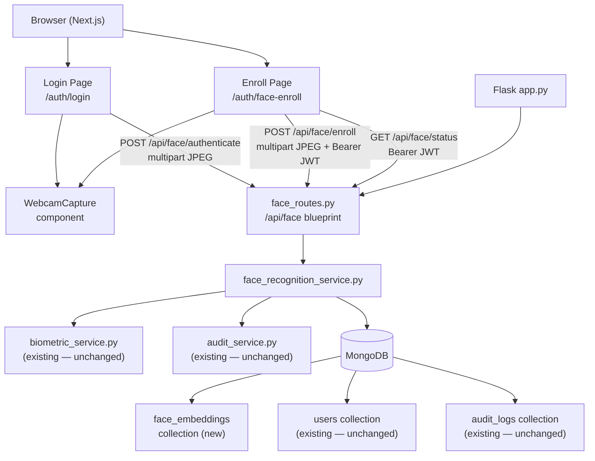

# Design Document — Face Recognition 2FA

## Overview

This document describes the technical design for adding face recognition as an additive,
optional biometric authentication method to the LexAI IDP platform. The existing fingerprint
authentication flow (ESP32 sensor polling and manual fingerprint ID entry) remains completely
unchanged. Face recognition is introduced as a parallel path: a new Flask blueprint, a new
service module, a new MongoDB collection, and new React components that extend the existing
login and settings surfaces without touching any existing code paths.

Face recognition processing runs entirely on the backend using the `face_recognition` Python
library (dlib-based). The browser captures a webcam frame and posts raw JPEG bytes to the
backend; no biometric computation happens client-side and no raw images are persisted.

### Scope

| Area | Change |
|------|--------|
| `backend/services/face_recognition_service.py` | **New** — encoding, comparison, storage |
| `backend/routes/face_routes.py` | **New** — Flask blueprint at `/api/face` |
| `backend/app.py` | **Additive only** — two lines to register the new blueprint |
| `frontend/src/components/WebcamCapture.tsx` | **New** — reusable webcam component |
| `frontend/src/app/auth/face-enroll/page.tsx` | **New** — enrollment page |
| `frontend/src/app/auth/login/page.tsx` | **Additive only** — third "Face ID" tab |
| `frontend/src/lib/api.ts` | **Additive only** — two new API helper functions |
| MongoDB `face_embeddings` collection | **New** |

---

## Architecture



### Key design decisions

**No modification to existing auth middleware.** `middleware/auth.py` guards only
`/api/blockchain/` and `/api/documents`. The face routes that need JWT (`/enroll` and
`/status`) perform inline token verification by calling `verify_token()` directly inside
the route handler — the same pattern already used in `biometric.py`'s `/profile` endpoint.

**dlib-based `face_recognition` library.** The library produces 128-dimensional float
vectors via HOG face detection + ResNet encoding. Cosine similarity is used for comparison
because it is independent of vector magnitude and matches common face recognition practice.

**Upsert on re-enrollment.** MongoDB's `update_one(..., upsert=True)` with a filter on
`user_id` guarantees exactly one embedding per user at all times without requiring an
explicit delete-then-insert.

**No image persistence.** Images are passed as in-memory `bytes` objects through the call
stack and never written to disk or MongoDB. The `face_recognition` library accepts image
arrays loaded via `PIL` / `numpy` directly from bytes.

---

## Components and Interfaces

### Backend

#### `services/face_recognition_service.py`

This is the central service module. It owns all face-related logic and MongoDB interaction.

```python
import os
import logging
import numpy as np
from datetime import datetime, timezone
from typing import Optional

import face_recognition
from models.document import db
from services.biometric_service import generate_access_token, verify_token
from services.audit_service import log_action

logger = logging.getLogger(__name__)

FACE_SIMILARITY_THRESHOLD: float = float(
    os.environ.get("FACE_SIMILARITY_THRESHOLD", "0.6")
)

_face_embeddings = db["face_embeddings"]

# Index created at module import time (idempotent)
try:
    _face_embeddings.create_index("user_id", unique=True)
except Exception as exc:
    logger.warning("face_recognition_service: could not create index: %s", exc)


def encode_face(image_bytes: bytes) -> list[float]:
    """Decode image bytes and extract a face embedding.

    Returns a 128-element list[float] when exactly one face is detected.
    Raises ValueError("no_face") if no face is found.
    Raises ValueError("multiple_faces") if more than one face is found.
    """
    ...


def find_match(embedding: list[float]) -> Optional[dict]:
    """Query face_embeddings, compute cosine similarity, return best match.

    Returns the user document (user_id, name, role) when the highest
    cosine similarity score meets or exceeds FACE_SIMILARITY_THRESHOLD.
    Returns None when no stored embedding meets the threshold.
    """
    ...


def enroll_face(user_id: str, name: str, role: str, image_bytes: bytes) -> None:
    """Encode image_bytes and upsert the embedding into face_embeddings.

    Raises ValueError("no_face") or ValueError("multiple_faces") if the
    image does not contain exactly one face.
    Calls log_action inside try/except so audit failures are non-fatal.
    """
    ...


def authenticate_face(image_bytes: bytes) -> Optional[dict]:
    """Full authentication flow: encode → find_match → audit.

    Returns {"token": str, "name": str, "role": str, "user_id": str} on
    success, or None on no match.
    Calls log_action for both success and failure inside try/except.
    """
    ...
```

**`encode_face` implementation detail**

```python
def encode_face(image_bytes: bytes) -> list[float]:
    import io
    from PIL import Image

    image = Image.open(io.BytesIO(image_bytes)).convert("RGB")
    rgb_array = np.array(image)

    locations = face_recognition.face_locations(rgb_array)
    if len(locations) == 0:
        raise ValueError("no_face")
    if len(locations) > 1:
        raise ValueError("multiple_faces")

    encodings = face_recognition.face_encodings(rgb_array, known_face_locations=locations)
    return encodings[0].tolist()   # numpy array → Python list[float]
```

**`find_match` implementation detail**

```python
def _cosine_similarity(a: list[float], b: list[float]) -> float:
    va, vb = np.array(a), np.array(b)
    denom = np.linalg.norm(va) * np.linalg.norm(vb)
    if denom == 0:
        return 0.0
    return float(np.dot(va, vb) / denom)


def find_match(embedding: list[float]) -> Optional[dict]:
    best_score = -1.0
    best_doc = None
    for doc in _face_embeddings.find({}, {"_id": 0}):
        score = _cosine_similarity(embedding, doc["embedding"])
        if score > best_score:
            best_score = score
            best_doc = doc
    if best_doc and best_score >= FACE_SIMILARITY_THRESHOLD:
        return best_doc
    return None
```

#### `routes/face_routes.py`

Flask blueprint registered at `/api/face`. Three endpoints.

```
POST /api/face/enroll         — JWT required (inline check), multipart image
POST /api/face/authenticate   — no JWT required, multipart image
GET  /api/face/status         — JWT required (inline check)
```

Inline JWT validation helper (same pattern as `biometric.py /profile`):

```python
import jwt as pyjwt
from flask import request, jsonify
from services.biometric_service import verify_token

def _require_jwt():
    """Extract and verify Bearer JWT from Authorization header.

    Returns (claims_dict, None) on success.
    Returns (None, error_response_tuple) on failure.
    """
    auth = request.headers.get("Authorization", "")
    if not auth.startswith("Bearer "):
        return None, (jsonify({"error": "Authorization header missing or malformed"}), 401)
    token = auth[len("Bearer "):]
    try:
        claims = verify_token(token)
        return claims, None
    except (pyjwt.ExpiredSignatureError, pyjwt.InvalidTokenError):
        return None, (jsonify({"error": "Invalid or expired token"}), 401)
```

**`POST /api/face/enroll`**

```
Request:  Authorization: Bearer <jwt>
          Content-Type: multipart/form-data
          file: <image>

Response 201: {"enrolled": true, "user_id": "<uid>"}
Response 401: {"error": "Authorization header missing or malformed"}
              {"error": "Invalid or expired token"}
Response 422: {"error": "No face detected in the image"}
              {"error": "Image must contain exactly one face"}
Response 400: {"error": "No image file provided"}
```

**`POST /api/face/authenticate`**

```
Request:  Content-Type: multipart/form-data
          file: <image>
          (no Authorization header required)

Response 200: {"token": str, "name": str, "role": str, "user_id": str}
Response 401: {"error": "Face not recognised"}
Response 422: {"error": "No face detected in the image"}
Response 400: {"error": "No image file provided"}
```

**`GET /api/face/status`**

```
Request:  Authorization: Bearer <jwt>

Response 200: {"enrolled": true}  |  {"enrolled": false}
Response 401: {"error": "..."}
```

#### Blueprint registration in `app.py` (additive only)

Two lines are appended after the existing blueprint registrations:

```python
from routes.face_routes import face_bp
app.register_blueprint(face_bp, url_prefix="/api/face")
```

No other line in `app.py` is changed.

---

### Frontend

#### `components/WebcamCapture.tsx`

Reusable component that manages the webcam stream lifecycle.

```typescript
interface WebcamCaptureProps {
  /** Ref exposed to parent for calling captureFrame() imperatively */
  ref?: React.Ref<WebcamCaptureHandle>;
  /** Called when the stream starts successfully */
  onReady?: () => void;
  /** Called when the stream cannot be started (permission denied, no camera) */
  onError?: (error: string) => void;
  className?: string;
}

interface WebcamCaptureHandle {
  /** Capture the current video frame and return it as a Blob (image/jpeg) */
  captureFrame(): Promise<Blob>;
}
```

**Implementation notes:**
- Uses `navigator.mediaDevices.getUserMedia({ video: true })` on mount.
- Streams into a `<video>` element (muted, autoPlay, playsInline).
- `captureFrame()` draws the video onto a hidden `<canvas>` and calls
  `canvas.toBlob(resolve, "image/jpeg", 0.92)`.
- On unmount (`useEffect` cleanup), calls `stream.getTracks().forEach(t => t.stop())`
  to release the camera hardware resource.
- Displays a fallback message when the browser has no camera or permission is denied.

#### `app/auth/face-enroll/page.tsx`

Protected page at `/auth/face-enroll`.

- On mount, reads `auth_token` from `localStorage`. If absent, calls
  `router.push("/auth/login")`.
- Calls `GET /api/face/status` (with Bearer token from `localStorage`) to populate the
  initial enrollment status indicator.
- Renders `<WebcamCapture ref={webcamRef} />`, a status badge ("Enrolled" / "Not enrolled"),
  and an "Enroll Face" button.
- On "Enroll Face" click: calls `webcamRef.current.captureFrame()`, builds a `FormData`
  with the blob appended as `"file"`, POSTs to `/api/face/enroll` with
  `Authorization: Bearer <token>`. Sets loading / success / error state from the response.
- Disables the button and shows a `Loader2` spinner during the request.

#### Login page additions (`app/auth/login/page.tsx`)

The existing two-button mode toggle is replaced with a three-button toggle. The two existing
buttons ("Sensor", "Manual ID") are untouched — their `onClick` handlers, state setters, and
polling logic are not modified. A third button is added:

```tsx
<button
  type="button"
  onClick={() => { setActiveTab("face"); setError(null); }}
  className={`flex-1 flex items-center justify-center gap-2 py-2 rounded-md text-sm
    font-medium transition-all ${activeTab === "face"
      ? "bg-blue-600 text-white shadow"
      : "text-slate-400 hover:text-white"}`}
>
  <Camera className="h-4 w-4" />
  Face ID
</button>
```

The existing `sensorMode` boolean is replaced by a three-value `activeTab` state
(`"sensor" | "manual" | "face"`), preserving all existing conditional rendering blocks.

When `activeTab === "face"`:
- `WebcamCapture` is rendered with `webcamRef`.
- A "Scan Face" button triggers `captureFrame()` → FormData → `POST /api/face/authenticate`.
- On 200 + token: calls `saveAuth(data)` and `router.push("/dashboard")` — identical to
  the existing fingerprint success path.
- On 401 / 422: sets the shared `error` state.
- During in-flight request: `loading = true`, button disabled, `Loader2` spinner shown.

`WebcamCapture` is only mounted when `activeTab === "face"`, so switching away from the tab
automatically unmounts the component and triggers its cleanup (stream stop).

#### `lib/api.ts` additions (additive only)

```typescript
export interface FaceAuthResponse {
  token: string;
  name: string;
  role: string;
  user_id: string;
}

export interface FaceStatusResponse {
  enrolled: boolean;
}

/** POST /api/face/authenticate — no auth token required */
export async function authenticateFace(imageBlob: Blob): Promise<FaceAuthResponse> {
  const formData = new FormData();
  formData.append("file", imageBlob, "face.jpg");
  const res = await api.post<FaceAuthResponse>("/api/face/authenticate", formData, {
    headers: { "Content-Type": "multipart/form-data" },
  });
  return res.data;
}

/** POST /api/face/enroll — requires Bearer token in Authorization header */
export async function enrollFace(imageBlob: Blob): Promise<{ enrolled: boolean; user_id: string }> {
  const formData = new FormData();
  formData.append("file", imageBlob, "face.jpg");
  const res = await api.post<{ enrolled: boolean; user_id: string }>(
    "/api/face/enroll",
    formData,
    { headers: { "Content-Type": "multipart/form-data" } }
  );
  return res.data;
}

/** GET /api/face/status — requires Bearer token */
export async function getFaceStatus(): Promise<FaceStatusResponse> {
  const res = await api.get<FaceStatusResponse>("/api/face/status");
  return res.data;
}
```

The existing axios `api` instance already attaches `Authorization: Bearer <token>` from
`localStorage` via its request interceptor, so `enrollFace` and `getFaceStatus` automatically
include the JWT without any extra code.

---

## Data Models

### `face_embeddings` MongoDB collection

```
{
  "_id":         ObjectId,           // auto-generated by MongoDB
  "user_id":     string,             // UUID from users collection — UNIQUE INDEX
  "name":        string,             // user display name (denormalised from users)
  "role":        string,             // user role (denormalised from users)
  "embedding":   [float, ...],       // 128-element list, dlib ResNet encoding
  "enrolled_at": ISODate             // UTC timestamp, datetime.now(timezone.utc)
}
```

**Index:**
```python
_face_embeddings.create_index("user_id", unique=True)
```

This index is created inside `face_recognition_service.py` at module import time using the
same idempotent try/except pattern as `biometric_service.py`.

**Upsert query (re-enrollment):**
```python
_face_embeddings.update_one(
    {"user_id": user_id},
    {"$set": {
        "name": name,
        "role": role,
        "embedding": embedding,   # list[float]
        "enrolled_at": datetime.now(tz=timezone.utc),
    }},
    upsert=True,
)
```

### No changes to `users` collection

The `users` collection schema is not modified. `face_embeddings` stores `name` and `role`
as denormalised copies (read at enrollment time) so that `find_match` can return user info
without a join.

### `audit_logs` collection (existing — unchanged)

New actions logged to the existing collection:

| `action` value | Trigger |
|---|---|
| `"login_face"` | Successful face authentication |
| `"login_face_failed"` | Face not recognised |
| `"face_enrolled"` | Successful enrollment |

---

## Correctness Properties

*A property is a characteristic or behavior that should hold true across all valid executions
of a system — essentially, a formal statement about what the system should do. Properties
serve as the bridge between human-readable specifications and machine-verifiable correctness
guarantees.*

### Property 1: Embedding serialisation round-trip

*For any* valid 128-element face embedding vector `e` (a list of floats), converting it to
JSON and back (via `json.dumps` / `json.loads`) produces a vector whose cosine similarity
with the original is `1.0`.

**Validates: Requirements 5.4**

---

### Property 2: Identity retrieval

*For any* user `U` whose embedding `E` has been stored in `face_embeddings` via `enroll_face`,
calling `find_match(E)` returns a document with `user_id` equal to `U.user_id`.

**Validates: Requirements 5.5, 2.1**

---

### Property 3: Non-match below threshold returns None

*For any* embedding `E_query` that was not enrolled and whose cosine similarity with every
stored embedding is below `FACE_SIMILARITY_THRESHOLD`, `find_match(E_query)` returns `None`.

**Validates: Requirements 2.3, 5.2**

---

### Property 4: Stored document schema invariant

*For any* successful enrollment call `enroll_face(user_id, name, role, image_bytes)`, the
document subsequently retrieved from `face_embeddings` for that `user_id` contains exactly
the fields `user_id`, `name`, `role`, `embedding`, and `enrolled_at`, where `embedding` is
a non-empty list of floats, and contains no field holding raw image bytes or base64-encoded
pixel data.

**Validates: Requirements 4.2, 4.3, 4.4, 1.6**

---

### Property 5: Upsert idempotence (one embedding per user)

*For any* user `U`, enrolling twice in sequence (with any two valid single-face images)
results in exactly one document in `face_embeddings` for `U.user_id`, and that document's
`embedding` matches the second enrollment, not the first.

**Validates: Requirements 1.7**

---

### Property 6: Audit-service failure does not block response

*For any* call to `enroll_face` or `authenticate_face` where `log_action` raises an
arbitrary exception, the primary return value (the enrollment confirmation or the matched
user document) is still returned correctly — the exception is swallowed without propagating.

**Validates: Requirements 9.4**

---

### Property 7: `encode_face` output is a valid embedding vector

*For any* JPEG image bytes containing exactly one face, `encode_face(image_bytes)` returns
a list of 128 floats (all finite, not NaN or Inf).

**Validates: Requirements 5.1**

---

## Error Handling

### Backend error table

| Scenario | HTTP status | Response body |
|---|---|---|
| No `file` in multipart request | 400 | `{"error": "No image file provided"}` |
| Image contains no face | 422 | `{"error": "No face detected in the image"}` |
| Image contains multiple faces | 422 | `{"error": "Image must contain exactly one face"}` |
| JWT missing or malformed | 401 | `{"error": "Authorization header missing or malformed"}` |
| JWT expired or invalid | 401 | `{"error": "Invalid or expired token"}` |
| Face not recognised | 401 | `{"error": "Face not recognised"}` |
| Unexpected server error | 500 | `{"error": "Internal server error"}` |

### Audit failure isolation

All `log_action` calls in `face_recognition_service.py` are wrapped in `try/except Exception:
pass` so that an unreachable MongoDB or audit service error never interrupts the auth or
enrollment response. This mirrors the pattern already used in `biometric.py` and `app.py`.

### Frontend error handling

- Network errors (no response) → generic "Unable to reach server" message on the Face ID tab.
- HTTP 422 → display the `error` value from the response body inline.
- HTTP 401 (from authenticate) → display "Face not recognised. Please try again."
- Camera permission denied → `WebcamCapture` renders an inline error message; the "Scan Face"
  button remains disabled.
- Errors on the Face ID tab are isolated to the `error` state slice for that tab and do not
  affect the Sensor or Manual ID tabs.

---

## Testing Strategy

### Unit tests (pytest, `backend/tests/`)

Focus on specific examples and error conditions:

- `encode_face` raises `ValueError("no_face")` for a blank image.
- `encode_face` raises `ValueError("multiple_faces")` for an image with two faces.
- `/api/face/enroll` returns 401 when no Authorization header is present.
- `/api/face/enroll` returns 401 when the JWT is expired.
- `/api/face/authenticate` returns 401 with `{"error": "Face not recognised"}` when
  `find_match` returns `None`.
- `/api/face/status` returns `{"enrolled": false}` for a user with no stored embedding.
- `/api/face/status` returns `{"enrolled": true}` for a user with a stored embedding.
- `log_action` is called with `action="login_face"` on successful authentication.
- `log_action` is called with `action="login_face_failed"` on failed authentication.
- `log_action` is called with `action="face_enrolled"` on successful enrollment.
- `FACE_SIMILARITY_THRESHOLD` defaults to `0.6` when `FACE_SIMILARITY_THRESHOLD` env var
  is not set, and respects the env var when it is set.

### Property-based tests (Hypothesis, `backend/tests/test_face_properties.py`)

Each property test runs a minimum of 100 iterations. The `face_recognition` library is
mocked to return controlled embeddings (random 128-dim float vectors) so tests are fast
and deterministic without requiring actual image data.

**Tag format: `Feature: face-recognition-2fa, Property {N}: {description}`**

**Property 1 — Embedding serialisation round-trip**
```python
# Feature: face-recognition-2fa, Property 1: embedding JSON round-trip cosine similarity = 1.0
@given(st.lists(st.floats(min_value=-1.0, max_value=1.0, allow_nan=False), min_size=128, max_size=128))
@settings(max_examples=200)
def test_embedding_roundtrip(embedding):
    import json
    from services.face_recognition_service import _cosine_similarity
    restored = json.loads(json.dumps(embedding))
    assert abs(_cosine_similarity(embedding, restored) - 1.0) < 1e-9
```

**Property 2 — Identity retrieval**
```python
# Feature: face-recognition-2fa, Property 2: find_match returns enrolled user's document
@given(st.text(min_size=1), st.text(min_size=1), st.text(min_size=1),
       st.lists(st.floats(min_value=-1.0, max_value=1.0, allow_nan=False), min_size=128, max_size=128))
@settings(max_examples=100)
def test_identity_retrieval(user_id, name, role, embedding):
    # Insert directly, then call find_match
    ...
```

**Property 3 — Non-match below threshold**
```python
# Feature: face-recognition-2fa, Property 3: dissimilar embedding returns None from find_match
@given(...)
@settings(max_examples=100)
def test_no_match_below_threshold(enrolled_embedding, query_embedding):
    # Force dissimilar embeddings, assert find_match returns None
    ...
```

**Property 4 — Stored document schema invariant**
```python
# Feature: face-recognition-2fa, Property 4: enrolled document contains only specified fields
@given(st.text(min_size=1), st.text(min_size=1), st.text(min_size=1))
@settings(max_examples=100)
def test_stored_document_schema(user_id, name, role):
    # Mock encode_face, call enroll_face, fetch document, assert schema
    ...
```

**Property 5 — Upsert idempotence**
```python
# Feature: face-recognition-2fa, Property 5: second enrollment overwrites first, count=1
@given(st.text(min_size=1), st.text(min_size=1), st.text(min_size=1))
@settings(max_examples=100)
def test_upsert_idempotence(user_id, name, role):
    # Enroll twice, assert count=1 and second embedding is stored
    ...
```

**Property 6 — Audit failure does not block response**
```python
# Feature: face-recognition-2fa, Property 6: log_action exception does not propagate
@given(st.text(min_size=1), ...)
@settings(max_examples=100)
def test_audit_failure_isolation(user_id, name, role, embedding):
    # Mock log_action to raise, call enroll_face/authenticate_face, assert no exception
    ...
```

**Property 7 — `encode_face` output shape**
```python
# Feature: face-recognition-2fa, Property 7: encode_face returns 128 finite floats
@given(st.binary(min_size=1))
@settings(max_examples=100)
def test_encode_face_output_shape(image_bytes):
    # Mock face_recognition to return a controlled result for valid single-face input
    ...
```

### Frontend tests (Jest + React Testing Library, `frontend/src/`)

- `WebcamCapture`: assert `getTracks()[].stop()` is called on unmount.
- Login page: assert three tabs render with labels "Sensor", "Manual ID", "Face ID" in order.
- Login page: clicking "Face ID" tab hides fingerprint UI, shows webcam and "Scan Face" button.
- Login page: successful face auth response calls `saveAuth` and `router.push("/dashboard")`.
- Login page: 401 response shows inline error, does not redirect.
- Enrollment page: unauthenticated user is redirected to `/auth/login`.
- Enrollment page: 201 response shows success message, status indicator updates to "Enrolled".
- Enrollment page: 422 response shows the `error` field from the response body.

### Integration tests

- `POST /api/face/enroll` → `GET /api/face/status` flow with a real (mocked) MongoDB instance.
- Existing `/api/biometric/*` endpoints return correct responses after `face_bp` is registered
  (verifying additive integration does not break existing routes).
