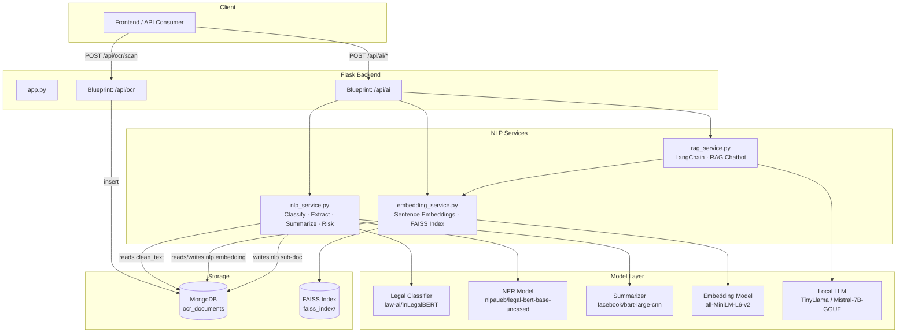
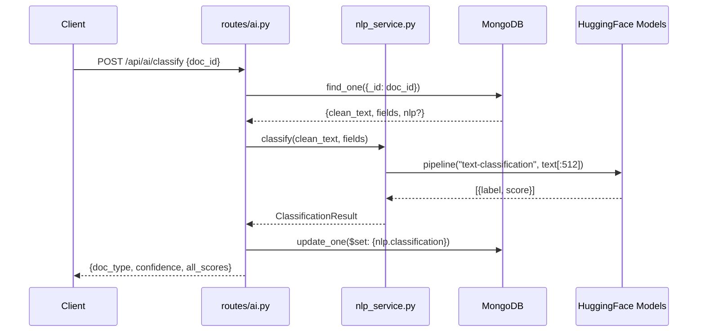
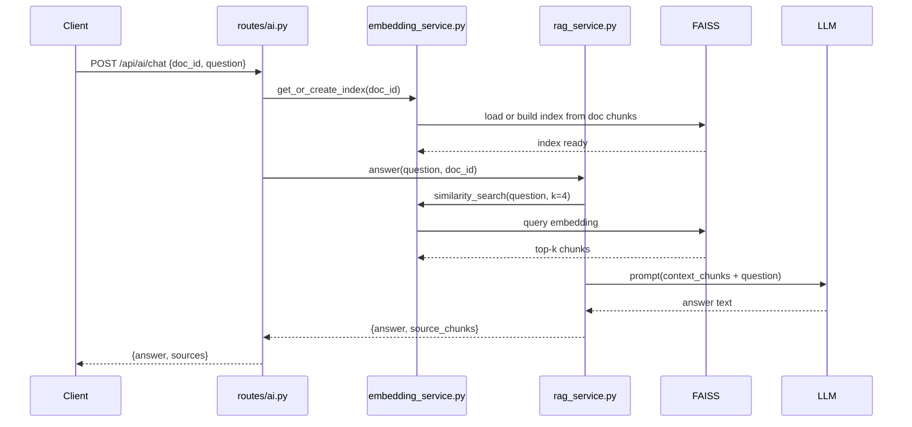

# Design Document: Legal NLP/LLM Module

## Overview

This module adds an intelligent NLP/LLM layer on top of the existing OCR pipeline in the Secure Legal Document Management system. It consumes `clean_text` and `fields` already stored in MongoDB's `ocr_documents` collection and produces higher-order outputs: document classification, deep entity extraction, legal clause detection, abstractive summarisation, risk/anomaly flagging, semantic search, and a retrieval-augmented generation (RAG) chatbot. All models are open-source and run locally, making the system viable as a student project without paid API dependencies.

The module is structured as two phases. Phase 1 (MVP) delivers the four core inference endpoints — classify, extract, summarize, risk-check — backed by a single `nlp_service.py` that lazy-loads HuggingFace transformer models. Phase 2 adds vector-based semantic search via FAISS and a RAG chatbot via LangChain, backed by `embedding_service.py` and `rag_service.py`. Both phases share the same Flask blueprint (`routes/ai.py`) and extend the existing MongoDB schema with an `nlp` sub-document.


## Architecture

### High-Level Component Diagram



### Data Flow: OCR Output → NLP Pipeline → API Response






## Components and Interfaces

### Component 1: `routes/ai.py` — AI Blueprint

**Purpose**: Flask blueprint that exposes all NLP/AI endpoints. Handles request validation, MongoDB document retrieval, delegates to service layer, persists NLP results back to MongoDB, and returns structured JSON responses.

**Interface**:
```python
ai_bp = Blueprint("ai", __name__)

# Phase 1 endpoints
@ai_bp.route("/classify",  methods=["POST"])  # body: {doc_id: str}
@ai_bp.route("/extract",   methods=["POST"])  # body: {doc_id: str}
@ai_bp.route("/summarize", methods=["POST"])  # body: {doc_id: str}
@ai_bp.route("/risk-check",methods=["POST"])  # body: {doc_id: str}

# Phase 2 endpoints
@ai_bp.route("/search",      methods=["POST"])  # body: {query: str, top_k?: int}
@ai_bp.route("/chat",        methods=["POST"])  # body: {doc_id: str, question: str}
@ai_bp.route("/cross-search",methods=["POST"])  # body: {query: str, doc_ids?: list[str]}
```

**Responsibilities**:
- Validate `doc_id` as a valid ObjectId; return 400 on malformed input
- Fetch document from `ocr_documents` collection; return 404 if not found
- Check `nlp` sub-document for cached results; return cached if `force=false`
- Delegate computation to service layer
- Persist NLP results to `nlp` sub-document via `$set`
- Return consistent JSON envelope: `{ok: bool, data: ..., cached: bool}`

---

### Component 2: `services/nlp_service.py` — Core NLP Service

**Purpose**: Lazy-loads and caches HuggingFace transformer pipelines. Provides the four Phase 1 inference functions. All models are loaded once at first call and reused across requests (module-level singletons).

**Interface**:
```python
def classify(text: str, fields: dict, lang: str = "eng") -> ClassificationResult: ...
def extract_entities(text: str, existing_fields: dict = {}, lang: str = "eng") -> EntityExtractionResult: ...
def summarize(text: str, max_length: int = 200, lang: str = "eng") -> SummarizationResult: ...
def risk_check(text: str, fields: dict, doc_type: str, lang: str = "eng") -> RiskResult: ...
```

**Responsibilities**:
- Manage pipeline singletons with thread-safe lazy initialisation
- Truncate input text to model max token limits before inference
- Merge transformer NER output with existing regex `fields` (dedup by span)
- Apply legal-domain heuristics for risk detection (missing clause patterns)
- Return typed dataclass results; never raise — return error-flagged results on failure

---

### Component 3: `services/embedding_service.py` — Embedding & Vector Search

**Purpose**: Generates sentence embeddings using `sentence-transformers/all-MiniLM-L6-v2`, manages per-document FAISS indices on disk, and provides similarity search.

**Interface**:
```python
def embed_text(text: str) -> np.ndarray: ...
def embed_chunks(chunks: list[str]) -> np.ndarray: ...
def build_index(doc_id: str, chunks: list[str]) -> FAISSIndex: ...
def load_index(doc_id: str) -> FAISSIndex | None: ...
def similarity_search(query: str, doc_id: str, k: int = 4) -> list[ChunkResult]: ...
def cross_document_search(query: str, doc_ids: list[str], k: int = 10) -> list[ChunkResult]: ...
```

**Responsibilities**:
- Chunk documents using a sliding window (512 tokens, 64-token overlap)
- Persist FAISS flat-L2 index to `faiss_index/{doc_id}.index` and metadata to `faiss_index/{doc_id}.meta.json`
- Normalise embeddings before indexing (cosine similarity via L2 on normalised vectors)
- Support cross-document search by merging multiple indices

---

### Component 4: `services/rag_service.py` — RAG Chatbot

**Purpose**: Implements retrieval-augmented generation using LangChain. Retrieves relevant chunks via `embedding_service`, constructs a prompt with context, and queries a local LLM.

**Interface**:
```python
def answer_question(
    question: str,
    doc_id: str,
    chat_history: list[dict] | None = None,
    k: int = 4,
) -> RAGResult: ...

def build_rag_chain(doc_id: str) -> ConversationalRetrievalChain: ...
```

**Responsibilities**:
- Build a LangChain `ConversationalRetrievalChain` backed by a FAISS retriever
- Use `CTransformers` or `llama-cpp-python` to load a GGUF quantised LLM locally
- Maintain conversation history per session (in-memory dict keyed by `doc_id`)
- Return answer text plus the source chunks used for grounding

---

### Component 5: `models/` — Data Models

**Purpose**: Typed dataclasses for all NLP result structures. Used as return types from service functions and serialised to JSON for API responses and MongoDB persistence.

```python
# models/nlp_models.py
@dataclass
class ClassificationResult:
    doc_type: str
    confidence: float
    all_scores: dict[str, float]

@dataclass
class EntityExtractionResult:
    persons: list[str]
    organisations: list[str]
    dates: list[str]
    money: list[str]
    locations: list[str]
    case_numbers: list[str]
    raw_entities: list[dict]   # [{text, label, score, start, end}]

@dataclass
class ClauseDetectionResult:
    clauses_found: list[str]   # e.g. ["indemnity", "termination"]
    clause_spans: list[dict]   # [{clause, text_snippet, start_char}]

@dataclass
class SummarizationResult:
    summary: str
    word_count: int
    compression_ratio: float

@dataclass
class RiskResult:
    risk_level: str            # "low" | "medium" | "high"
    flags: list[RiskFlag]
    score: float               # 0.0–1.0

@dataclass
class RiskFlag:
    category: str              # "missing_clause" | "date_inconsistency" | "unusual_term"
    description: str
    severity: str              # "warning" | "error"

@dataclass
class ChunkResult:
    chunk_text: str
    doc_id: str
    chunk_index: int
    score: float

@dataclass
class RAGResult:
    answer: str
    source_chunks: list[ChunkResult]
    model_used: str
```


## Data Models

### MongoDB Schema Extension — `nlp` Sub-Document

The existing `ocr_documents` collection is extended with an `nlp` field. This is written lazily — only populated when an AI endpoint is called for that document. Existing documents without `nlp` are treated as unprocessed.

```json
{
  "_id": "ObjectId",
  "filename": "string",
  "raw_text": "string",
  "clean_text": "string",
  "fields": { "...existing regex fields..." },
  "boxes": ["...word bounding boxes..."],
  "lang": "string",
  "lang_detected": "string",
  "created_at": "datetime",

  "nlp": {
    "classification": {
      "doc_type": "string",
      "confidence": "float",
      "all_scores": { "FIR": 0.91, "contract": 0.05, "...": "..." },
      "model": "string",
      "processed_at": "datetime"
    },
    "entities": {
      "persons": ["string"],
      "organisations": ["string"],
      "dates": ["string"],
      "money": ["string"],
      "locations": ["string"],
      "case_numbers": ["string"],
      "raw_entities": [
        { "text": "string", "label": "string", "score": "float", "start": "int", "end": "int" }
      ],
      "model": "string",
      "processed_at": "datetime"
    },
    "clauses": {
      "clauses_found": ["string"],
      "clause_spans": [
        { "clause": "string", "text_snippet": "string", "start_char": "int" }
      ],
      "processed_at": "datetime"
    },
    "summary": {
      "text": "string",
      "word_count": "int",
      "compression_ratio": "float",
      "model": "string",
      "processed_at": "datetime"
    },
    "risk": {
      "risk_level": "string",
      "score": "float",
      "flags": [
        { "category": "string", "description": "string", "severity": "string" }
      ],
      "processed_at": "datetime"
    },
    "embedding": {
      "model": "string",
      "chunk_count": "int",
      "index_path": "string",
      "indexed_at": "datetime"
    }
  }
}
```

**Validation Rules**:
- `nlp.classification.confidence` must be in [0.0, 1.0]
- `nlp.risk.score` must be in [0.0, 1.0]
- `nlp.risk.risk_level` must be one of `"low"`, `"medium"`, `"high"`
- `nlp.embedding.index_path` must point to an existing `.index` file on disk
- All `processed_at` fields are UTC datetimes

### MongoDB Indexes to Add

```python
# In models/document.py or a migration script
db["ocr_documents"].create_index([("nlp.classification.doc_type", 1)])
db["ocr_documents"].create_index([("nlp.risk.risk_level", 1)])
db["ocr_documents"].create_index([("created_at", -1)])
```


## Model Selection Rationale

| Task | Model | HuggingFace ID | Why |
|------|-------|----------------|-----|
| Document Classification | InLegalBERT | `law-ai/InLegalBERT` | Fine-tuned on Indian legal corpus; covers FIR, contracts, affidavits, judgments; ~110M params, fits in 2GB RAM |
| Named Entity Recognition | Legal-BERT NER | `nlpaueb/legal-bert-base-uncased` + custom NER head | Pre-trained on legal text; better than generic BERT for legal entity types (PERSON, ORG, DATE, MONEY, GPE) |
| Clause Detection | Zero-shot NLI | `cross-encoder/nli-MiniLM2-L6-H768` | Zero-shot classification via NLI — no fine-tuning needed; classify text against clause labels; 22M params |
| Summarisation | BART-large-CNN | `facebook/bart-large-cnn` | Best open-source abstractive summariser; handles long documents via chunking; ~400M params |
| Sentence Embeddings | all-MiniLM-L6-v2 | `sentence-transformers/all-MiniLM-L6-v2` | 22M params, 384-dim embeddings, fast inference (~14k sentences/sec on CPU), excellent semantic similarity; handles multilingual text including Devanagari |
| Indic NLP | IndicBERT | `ai4bharat/indic-bert` | Multilingual BERT pre-trained on 12 Indian languages (Hindi, Tamil, Telugu, Kannada, Malayalam, Bengali, Gujarati, Punjabi, Marathi, Urdu, Odia, Assamese); ~110M params; used for classification and NER on Devanagari-script documents |
| Local LLM (RAG) | TinyLlama-1.1B-Chat | `TinyLlama/TinyLlama-1.1B-Chat-v1.0` (GGUF) | 1.1B params, runs on CPU with llama-cpp-python, good instruction following for Q&A |
| Local LLM (upgrade) | Mistral-7B-Instruct | `TheBloke/Mistral-7B-Instruct-v0.2-GGUF` | 7B params Q4_K_M quantisation (~4GB RAM), significantly better quality if GPU available |

**Fallback Strategy**: If a model fails to load (OOM, missing weights), the service returns a graceful error response with `{"ok": false, "error": "model_unavailable", "detail": "..."}` rather than crashing the Flask process.

**Memory Budget** (student laptop, 8GB RAM):
- Classification + NER + Zero-shot NLI: ~1.5GB total (loaded on demand, shared process)
- BART summariser: ~1.6GB (loaded separately, unloaded after use if memory pressure detected)
- Sentence embeddings: ~90MB (always resident)
- TinyLlama GGUF: ~700MB (loaded on first `/chat` call)
- Total worst case: ~4GB — fits in 8GB with OS overhead


## Multilingual Support

### Script-Family Routing Strategy

The NLP module reads `lang_detected` from the MongoDB document (falling back to `lang` if `lang_detected` is absent) and routes each inference call to the appropriate model or strategy based on the detected script family. This avoids applying English-only transformer models to non-Latin text, where they would produce meaningless output.

A helper function `_detect_script_family(lang: str) -> str` maps Tesseract language codes to one of four script families: `"latin"`, `"devanagari"`, `"indic"`, `"arabic"`. Compound codes such as `"eng+hin"` are handled by giving precedence to the non-English part.

### Script Family → NLP Strategy Mapping

| Script Family | Languages | Classification | NER | Clause Detection | Summarisation | Embeddings |
|---|---|---|---|---|---|---|
| Latin | `eng` | `law-ai/InLegalBERT` (zero-shot) | `nlpaueb/legal-bert-base-uncased` | NLI zero-shot (English labels) | `facebook/bart-large-cnn` | `all-MiniLM-L6-v2` |
| Devanagari | `hin`, `mar` | `ai4bharat/indic-bert` (zero-shot) | `ai4bharat/indic-bert` (token-classification) | Skip — return `ClauseDetectionResult([], [])` | Extractive: first 3 sentences of `clean_text` | `all-MiniLM-L6-v2` |
| Other Indic | `tam`, `tel`, `kan`, `mal`, `ben`, `guj`, `pan` | Regex/field-based only (`doc_type_hint` from `fields`) | Regex `fields` only — no transformer NER | Skip — return `ClauseDetectionResult([], [])` | Extractive: first 3 sentences | `all-MiniLM-L6-v2` |
| Arabic | `urd`, `ara` | Regex/field-based only | Regex `fields` only | Skip — return `ClauseDetectionResult([], [])` | Extractive: first 3 sentences | `all-MiniLM-L6-v2` |

### Key Design Decisions

1. **Single embedding model for all languages**: `all-MiniLM-L6-v2` handles multilingual text including Devanagari adequately for semantic search. No separate embedding model is needed per language.
2. **Graceful degradation for unsupported scripts**: For Other Indic and Arabic scripts, transformer models are skipped entirely. Classification uses `fields["doc_type_hint"]` from the regex parser (wrapped in `ClassificationResult` with `confidence=0.8` if the hint exists, else `"unknown"`). Entity extraction returns an `EntityExtractionResult` populated from `existing_fields` only.
3. **Clause detection is English-only**: NLI clause labels are English strings. Applying them to non-Latin text produces unreliable scores, so clause detection is skipped for all non-Latin script families.
4. **Extractive summarisation for non-Latin**: BART is an English model. For non-Latin scripts, the service returns the first 3 sentences of `clean_text` as an extractive summary, with `compression_ratio` computed accordingly.
5. **`lang` stored in every `nlp` sub-document write**: Every `$set` write to the `nlp` sub-document includes the `lang` field alongside `processed_at` and `model`, enabling downstream filtering by language.


## Algorithmic Pseudocode

### Algorithm 0: Language-Aware NLP Dispatch

```pascal
ALGORITHM detect_script_family(lang)
INPUT:  lang — language code string (e.g. "eng", "hin", "eng+hin", "tam")
OUTPUT: script_family — one of "latin", "devanagari", "indic", "arabic"

CONSTANTS:
  DEVANAGARI_LANGS = {"hin", "mar"}
  INDIC_LANGS      = {"tam", "tel", "kan", "mal", "ben", "guj", "pan"}
  ARABIC_LANGS     = {"urd", "ara"}

PRECONDITIONS:
  - lang is a non-empty string (valid Tesseract language code or compound code)

POSTCONDITIONS:
  - Returns exactly one of "latin", "devanagari", "indic", "arabic"
  - Compound codes like "eng+hin" give precedence to the non-English part

BEGIN
  // Handle compound codes like "eng+hin"
  parts   ← lang.lower().split("+")

  // Non-English part takes precedence for script detection
  non_eng ← [p FOR p IN parts IF p != "eng"]
  primary ← non_eng[0] IF non_eng ELSE "eng"

  IF primary IN DEVANAGARI_LANGS THEN RETURN "devanagari"
  IF primary IN INDIC_LANGS      THEN RETURN "indic"
  IF primary IN ARABIC_LANGS     THEN RETURN "arabic"
  RETURN "latin"
END
```

**Usage in service functions**: Each of the four Phase 1 service functions calls `_detect_script_family(lang)` at the top of its body and branches on the returned family to select the appropriate model or fallback strategy (see updated function signatures in Component 2).

---

### Algorithm 1: Document Classification

```pascal
ALGORITHM classify(text, fields)
INPUT:  text  — clean_text string from MongoDB (may be empty)
        fields — parsed fields dict from regex parser
OUTPUT: ClassificationResult

PRECONDITIONS:
  - text is a string (may be empty)
  - fields is a dict (may be empty)

POSTCONDITIONS:
  - result.doc_type is one of the known legal document types
  - result.confidence is in [0.0, 1.0]
  - result.all_scores sums to approximately 1.0

BEGIN
  IF text is empty OR len(text) < 20 THEN
    RETURN ClassificationResult(doc_type="unknown", confidence=0.0, all_scores={})
  END IF

  // Step 1: Truncate to model max tokens (512 for BERT-based models)
  truncated ← truncate_to_tokens(text, max_tokens=512)

  // Step 2: Run zero-shot or fine-tuned classification pipeline
  pipeline ← get_classification_pipeline()   // lazy singleton
  raw_scores ← pipeline(truncated, candidate_labels=LEGAL_DOC_TYPES)

  // Step 3: Apply field-based heuristic boost
  // e.g. if fields["fir_number"] exists, boost "FIR" score
  boosted_scores ← apply_field_hints(raw_scores, fields)

  // Step 4: Normalise scores
  total ← SUM(boosted_scores.values())
  normalised ← {label: score/total FOR label, score IN boosted_scores}

  best_label ← ARGMAX(normalised)
  best_score ← normalised[best_label]

  ASSERT best_score >= 0.0 AND best_score <= 1.0

  RETURN ClassificationResult(
    doc_type   = best_label,
    confidence = best_score,
    all_scores = normalised
  )
END
```

**Loop Invariants**: N/A (no loops in main path)

---

### Algorithm 2: Entity Extraction with Deduplication

```pascal
ALGORITHM extract_entities(text, existing_fields)
INPUT:  text            — clean_text string
        existing_fields — regex-extracted fields from parser.py
OUTPUT: EntityExtractionResult

PRECONDITIONS:
  - text is a non-empty string
  - existing_fields is a dict (may be empty)

POSTCONDITIONS:
  - All entity lists contain only unique, non-empty strings
  - raw_entities contains span information for each detected entity
  - No entity appears in both transformer output and regex output (deduped)

BEGIN
  // Step 1: Run transformer NER pipeline
  ner_pipeline ← get_ner_pipeline()
  chunks ← split_into_chunks(text, max_tokens=512, overlap=64)
  raw_entities ← []

  FOR each chunk IN chunks DO
    // LOOP INVARIANT: raw_entities contains all entities from processed chunks
    chunk_entities ← ner_pipeline(chunk)
    raw_entities ← raw_entities + chunk_entities
  END FOR

  // Step 2: Aggregate by entity type
  transformer_map ← group_by_label(raw_entities)
  // transformer_map = {"PER": [...], "ORG": [...], "DATE": [...], ...}

  // Step 3: Merge with regex fields (regex takes precedence for structured fields)
  persons       ← deduplicate(transformer_map["PER"] + existing_fields.get("names", []))
  organisations ← deduplicate(transformer_map["ORG"])
  dates         ← deduplicate(transformer_map["DATE"] + existing_fields.get("dates", []))
  money         ← deduplicate(transformer_map["MONEY"] + existing_fields.get("financial", []))
  locations     ← deduplicate(transformer_map["GPE"] + existing_fields.get("locations", []))
  case_numbers  ← deduplicate(existing_fields.get("document_ids", []))

  ASSERT ALL(len(e) > 0 FOR e IN persons + organisations + dates + money + locations)

  RETURN EntityExtractionResult(
    persons=persons, organisations=organisations,
    dates=dates, money=money, locations=locations,
    case_numbers=case_numbers, raw_entities=raw_entities
  )
END
```

**Loop Invariants**: After processing chunk `i`, `raw_entities` contains all entities from chunks `0..i`.

---

### Algorithm 3: Clause Detection via Zero-Shot NLI

```pascal
ALGORITHM detect_clauses(text)
INPUT:  text — clean_text string
OUTPUT: ClauseDetectionResult

PRECONDITIONS:
  - text is a non-empty string

POSTCONDITIONS:
  - clauses_found contains only labels from LEGAL_CLAUSE_LABELS
  - Each entry in clause_spans has a valid text_snippet from the input text
  - NLI entailment threshold is 0.7 (configurable)

CONSTANTS:
  LEGAL_CLAUSE_LABELS = [
    "indemnity clause", "termination clause", "jurisdiction clause",
    "arbitration clause", "confidentiality clause", "force majeure clause",
    "limitation of liability clause", "payment terms clause",
    "intellectual property clause", "governing law clause"
  ]
  ENTAILMENT_THRESHOLD = 0.7
  WINDOW_SIZE = 3   // sentences per window

BEGIN
  sentences ← split_into_sentences(text)
  windows   ← create_sliding_windows(sentences, size=WINDOW_SIZE, step=1)
  nli_pipeline ← get_nli_pipeline()

  found_clauses ← {}   // label → best_score
  clause_spans  ← []

  FOR each window IN windows DO
    // LOOP INVARIANT: found_clauses contains best scores for all processed windows
    window_text ← JOIN(window.sentences)

    FOR each label IN LEGAL_CLAUSE_LABELS DO
      result ← nli_pipeline(window_text, candidate_labels=[label])
      score  ← result["scores"][0]

      IF score >= ENTAILMENT_THRESHOLD THEN
        IF label NOT IN found_clauses OR found_clauses[label] < score THEN
          found_clauses[label] ← score
          clause_spans.append({
            clause: label,
            text_snippet: window_text[:200],
            start_char: window.start_char
          })
        END IF
      END IF
    END FOR
  END FOR

  RETURN ClauseDetectionResult(
    clauses_found = KEYS(found_clauses),
    clause_spans  = clause_spans
  )
END
```

---

### Algorithm 4: Chunked Summarisation

```pascal
ALGORITHM summarize(text, max_length)
INPUT:  text       — clean_text string
        max_length — target summary length in tokens (default 200)
OUTPUT: SummarizationResult

PRECONDITIONS:
  - text is a non-empty string with len(text) >= 100
  - max_length is a positive integer

POSTCONDITIONS:
  - summary is a non-empty string
  - compression_ratio = len(summary.split()) / len(text.split())
  - compression_ratio < 1.0 (summary is shorter than input)

BEGIN
  word_count_input ← len(text.split())

  IF word_count_input <= 600 THEN
    // Short document: summarise directly
    summary ← summarizer_pipeline(text, max_length=max_length, min_length=50)
  ELSE
    // Long document: map-reduce summarisation
    chunks ← split_into_chunks(text, max_tokens=900, overlap=50)
    chunk_summaries ← []

    FOR each chunk IN chunks DO
      // LOOP INVARIANT: chunk_summaries contains summaries of all processed chunks
      partial ← summarizer_pipeline(chunk, max_length=150, min_length=30)
      chunk_summaries.append(partial)
    END FOR

    // Reduce: summarise the chunk summaries
    combined ← JOIN(chunk_summaries, separator="\n")
    summary  ← summarizer_pipeline(combined, max_length=max_length, min_length=50)
  END IF

  word_count_output ← len(summary.split())
  compression_ratio ← word_count_output / MAX(word_count_input, 1)

  ASSERT len(summary) > 0
  ASSERT compression_ratio < 1.0

  RETURN SummarizationResult(
    summary=summary,
    word_count=word_count_output,
    compression_ratio=compression_ratio
  )
END
```

---

### Algorithm 5: Risk/Anomaly Detection

```pascal
ALGORITHM risk_check(text, fields, doc_type, clauses_found)
INPUT:  text          — clean_text string
        fields        — regex-extracted fields dict
        doc_type      — classified document type string
        clauses_found — list of detected clause labels
OUTPUT: RiskResult

PRECONDITIONS:
  - doc_type is a known legal document type or "unknown"
  - fields is a dict (may be empty)

POSTCONDITIONS:
  - risk_level is one of "low", "medium", "high"
  - score is in [0.0, 1.0]
  - Each flag has a non-empty category and description

CONSTANTS:
  REQUIRED_CLAUSES_BY_TYPE = {
    "contract":   ["termination clause", "jurisdiction clause", "payment terms clause"],
    "agreement":  ["termination clause", "governing law clause"],
    "FIR":        [],
    "affidavit":  [],
  }
  RISK_WEIGHTS = {
    "missing_clause":      0.25,
    "date_inconsistency":  0.30,
    "unusual_term":        0.20,
    "missing_party":       0.25,
  }

BEGIN
  flags ← []
  raw_score ← 0.0

  // Check 1: Missing required clauses
  required ← REQUIRED_CLAUSES_BY_TYPE.get(doc_type, [])
  FOR each clause IN required DO
    IF clause NOT IN clauses_found THEN
      flags.append(RiskFlag(
        category    = "missing_clause",
        description = f"Expected '{clause}' not found in {doc_type}",
        severity    = "warning"
      ))
      raw_score ← raw_score + RISK_WEIGHTS["missing_clause"]
    END IF
  END FOR

  // Check 2: Date inconsistency
  dates ← fields.get("dates", [])
  IF len(dates) >= 2 THEN
    parsed_dates ← [parse_date(d) FOR d IN dates IF parse_date(d) IS NOT NULL]
    IF has_future_date_before_past_date(parsed_dates) THEN
      flags.append(RiskFlag(
        category    = "date_inconsistency",
        description = "Document contains logically inconsistent date ordering",
        severity    = "error"
      ))
      raw_score ← raw_score + RISK_WEIGHTS["date_inconsistency"]
    END IF
  END IF

  // Check 3: Missing party names
  IF doc_type IN ["contract", "agreement", "affidavit"] THEN
    IF len(fields.get("names", [])) < 2 THEN
      flags.append(RiskFlag(
        category    = "missing_party",
        description = "Fewer than 2 party names detected in document",
        severity    = "warning"
      ))
      raw_score ← raw_score + RISK_WEIGHTS["missing_party"]
    END IF
  END IF

  // Check 4: Unusual terms via keyword scan
  unusual_terms ← scan_unusual_terms(text)
  FOR each term IN unusual_terms DO
    flags.append(RiskFlag(
      category    = "unusual_term",
      description = f"Unusual legal term detected: '{term}'",
      severity    = "warning"
    ))
    raw_score ← raw_score + RISK_WEIGHTS["unusual_term"] / MAX(len(unusual_terms), 1)
  END FOR

  // Normalise score to [0, 1]
  final_score ← MIN(raw_score, 1.0)

  IF final_score < 0.25 THEN
    risk_level ← "low"
  ELSE IF final_score < 0.60 THEN
    risk_level ← "medium"
  ELSE
    risk_level ← "high"
  END IF

  ASSERT final_score >= 0.0 AND final_score <= 1.0
  ASSERT risk_level IN ["low", "medium", "high"]

  RETURN RiskResult(risk_level=risk_level, flags=flags, score=final_score)
END
```

---

### Algorithm 6: Document Chunking with Sliding Window

```pascal
ALGORITHM chunk_document(text, max_tokens, overlap)
INPUT:  text       — document text string
        max_tokens — maximum tokens per chunk (default 512)
        overlap    — token overlap between consecutive chunks (default 64)
OUTPUT: list of ChunkInfo(text, start_char, end_char, index)

PRECONDITIONS:
  - max_tokens > overlap >= 0
  - text is a non-empty string

POSTCONDITIONS:
  - Every character in text is covered by at least one chunk
  - Consecutive chunks overlap by approximately `overlap` tokens
  - No chunk exceeds max_tokens tokens

BEGIN
  words  ← text.split()
  step   ← max_tokens - overlap
  chunks ← []
  i      ← 0
  idx    ← 0

  WHILE i < len(words) DO
    // LOOP INVARIANT: chunks covers text[0..words[i-1]], i increases by step each iteration
    chunk_words ← words[i : i + max_tokens]
    chunk_text  ← JOIN(chunk_words, " ")

    start_char ← find_char_offset(text, i)
    end_char   ← find_char_offset(text, MIN(i + max_tokens, len(words)))

    chunks.append(ChunkInfo(
      text=chunk_text, start_char=start_char,
      end_char=end_char, index=idx
    ))

    i   ← i + step
    idx ← idx + 1
  END WHILE

  ASSERT len(chunks) >= 1
  ASSERT chunks[0].start_char == 0

  RETURN chunks
END
```

---

### Algorithm 7: FAISS Index Build and Search

```pascal
ALGORITHM build_faiss_index(doc_id, chunks)
INPUT:  doc_id — MongoDB document ObjectId string
        chunks — list of ChunkInfo
OUTPUT: FAISSIndex (persisted to disk)

PRECONDITIONS:
  - len(chunks) >= 1
  - doc_id is a valid non-empty string

POSTCONDITIONS:
  - Index file exists at faiss_index/{doc_id}.index
  - Metadata file exists at faiss_index/{doc_id}.meta.json
  - Index contains exactly len(chunks) vectors

BEGIN
  embedding_model ← get_embedding_model()   // all-MiniLM-L6-v2 singleton
  texts           ← [c.text FOR c IN chunks]
  embeddings      ← embedding_model.encode(texts, normalize_embeddings=True)
  // embeddings shape: (len(chunks), 384)

  dim   ← embeddings.shape[1]   // 384
  index ← faiss.IndexFlatIP(dim)  // Inner product on normalised = cosine similarity
  index.add(embeddings)

  ASSERT index.ntotal == len(chunks)

  // Persist index
  faiss.write_index(index, f"faiss_index/{doc_id}.index")

  // Persist metadata (chunk texts + offsets for retrieval)
  metadata ← [{"text": c.text, "start": c.start_char, "index": c.index} FOR c IN chunks]
  write_json(f"faiss_index/{doc_id}.meta.json", metadata)

  RETURN index
END

ALGORITHM similarity_search(query, doc_id, k)
INPUT:  query  — natural language query string
        doc_id — document to search within
        k      — number of results to return (default 4)
OUTPUT: list of ChunkResult

PRECONDITIONS:
  - query is a non-empty string
  - Index file for doc_id exists on disk
  - k >= 1

POSTCONDITIONS:
  - Returns at most k results
  - Results are sorted by descending similarity score
  - Each result score is in [0.0, 1.0] (cosine similarity on normalised vectors)

BEGIN
  index    ← faiss.read_index(f"faiss_index/{doc_id}.index")
  metadata ← read_json(f"faiss_index/{doc_id}.meta.json")

  embedding_model ← get_embedding_model()
  query_vec       ← embedding_model.encode([query], normalize_embeddings=True)

  scores, indices ← index.search(query_vec, k)

  results ← []
  FOR i IN range(len(indices[0])) DO
    idx ← indices[0][i]
    IF idx >= 0 THEN   // FAISS returns -1 for empty slots
      results.append(ChunkResult(
        chunk_text  = metadata[idx]["text"],
        doc_id      = doc_id,
        chunk_index = metadata[idx]["index"],
        score       = float(scores[0][i])
      ))
    END IF
  END FOR

  ASSERT ALL(r.score >= 0.0 FOR r IN results)
  RETURN results
END
```


## Key Functions with Formal Specifications

### `nlp_service.py`

```python
def get_classification_pipeline() -> Pipeline:
    """
    Preconditions:
      - HuggingFace model 'law-ai/InLegalBERT' is available (downloaded or cached)
    Postconditions:
      - Returns a singleton pipeline instance (same object on repeated calls)
      - Pipeline is configured for zero-shot-classification task
    Side effects:
      - Downloads model weights on first call (~440MB)
      - Stores pipeline in module-level _PIPELINES dict
    """

def get_indic_classification_pipeline() -> Pipeline:
    """
    Preconditions:
      - HuggingFace model 'ai4bharat/indic-bert' is available (downloaded or cached)
    Postconditions:
      - Returns a singleton pipeline instance (same object on repeated calls)
      - Pipeline is configured for zero-shot-classification task
    Side effects:
      - Downloads model weights on first call (~440MB)
      - Stores pipeline in module-level _PIPELINES["indic_classify"]
    """

def get_indic_ner_pipeline() -> Pipeline:
    """
    Preconditions:
      - HuggingFace model 'ai4bharat/indic-bert' is available (downloaded or cached)
    Postconditions:
      - Returns a singleton pipeline instance (same object on repeated calls)
      - Pipeline is configured for token-classification (NER) task
    Side effects:
      - Downloads model weights on first call (shared with indic_classify if same base)
      - Stores pipeline in module-level _PIPELINES["indic_ner"]
    """

def classify(text: str, fields: dict, lang: str = "eng") -> ClassificationResult:
    """
    Preconditions:
      - text is a str (may be empty)
      - fields is a dict (may be empty)
      - lang is a valid Tesseract language code string (default "eng")
    Postconditions:
      - result.doc_type is in LEGAL_DOC_TYPES or "unknown"
      - result.confidence in [0.0, 1.0]
      - sum(result.all_scores.values()) ≈ 1.0 (within floating point tolerance)
      - Never raises; returns doc_type="unknown" on model failure
      - For latin script: uses InLegalBERT zero-shot pipeline
      - For devanagari script: uses ai4bharat/indic-bert zero-shot pipeline
      - For indic/arabic script: uses fields["doc_type_hint"] with confidence=0.8
    """

def extract_entities(text: str, existing_fields: dict = {}, lang: str = "eng") -> EntityExtractionResult:
    """
    Preconditions:
      - text is a str (may be empty)
      - existing_fields is a dict (may be empty)
      - lang is a valid Tesseract language code string (default "eng")
    Postconditions:
      - All entity lists contain unique, stripped, non-empty strings
      - raw_entities contains dicts with keys: text, label, score, start, end
      - Never raises; returns empty lists on model failure
      - For latin script: uses Legal-BERT NER transformer pipeline
      - For devanagari script: uses ai4bharat/indic-bert token-classification pipeline
      - For indic/arabic script: returns EntityExtractionResult populated from existing_fields only (no transformer invoked)
    """

def summarize(text: str, max_length: int = 200, lang: str = "eng") -> SummarizationResult:
    """
    Preconditions:
      - text is a non-empty str with len(text.split()) >= 30
      - max_length > 0
      - lang is a valid Tesseract language code string (default "eng")
    Postconditions:
      - result.summary is a non-empty string
      - result.compression_ratio < 1.0
      - result.word_count == len(result.summary.split())
      - Never raises; returns truncated input as summary on model failure
      - For latin script: uses BART abstractive summarisation
      - For devanagari/indic/arabic script: returns extractive summary (first 3 sentences of clean_text)
    """

def risk_check(
    text: str,
    fields: dict,
    doc_type: str,
    clauses_found: list[str],
) -> RiskResult:
    """
    Preconditions:
      - text is a str (may be empty)
      - doc_type is a str (may be "unknown")
      - clauses_found is a list of strings (may be empty)
    Postconditions:
      - result.risk_level in {"low", "medium", "high"}
      - result.score in [0.0, 1.0]
      - len(result.flags) >= 0
      - Each flag.severity in {"warning", "error"}
      - Never raises
    """
```

### `embedding_service.py`

```python
def embed_text(text: str) -> np.ndarray:
    """
    Preconditions:
      - text is a non-empty string
    Postconditions:
      - Returns 1D numpy array of shape (384,)
      - Array is L2-normalised (norm ≈ 1.0)
    """

def build_index(doc_id: str, chunks: list[ChunkInfo]) -> faiss.Index:
    """
    Preconditions:
      - doc_id is a non-empty string
      - len(chunks) >= 1
      - faiss_index/ directory is writable
    Postconditions:
      - File faiss_index/{doc_id}.index exists after call
      - File faiss_index/{doc_id}.meta.json exists after call
      - index.ntotal == len(chunks)
    """

def similarity_search(
    query: str,
    doc_id: str,
    k: int = 4,
) -> list[ChunkResult]:
    """
    Preconditions:
      - query is a non-empty string
      - faiss_index/{doc_id}.index exists on disk
      - k >= 1
    Postconditions:
      - Returns list of length <= k
      - Results sorted by descending score
      - Each result.score in [0.0, 1.0]
    """
```

### `rag_service.py`

```python
def answer_question(
    question: str,
    doc_id: str,
    chat_history: list[dict] | None = None,
    k: int = 4,
) -> RAGResult:
    """
    Preconditions:
      - question is a non-empty string
      - doc_id is a valid ObjectId string
      - FAISS index for doc_id exists (build_index was called)
      - k >= 1
    Postconditions:
      - result.answer is a non-empty string
      - len(result.source_chunks) <= k
      - result.model_used identifies the LLM used
      - Never raises; returns error message in result.answer on LLM failure
    """
```


---

## Correctness Properties

*A property is a characteristic or behavior that should hold true across all valid executions of a system — essentially, a formal statement about what the system should do. Properties serve as the bridge between human-readable specifications and machine-verifiable correctness guarantees.*

### Property 1: Classification scores are a valid probability distribution

*For any* non-empty `clean_text` input of 20 or more characters, the `ClassificationResult` returned by `classify()` SHALL have `all_scores` values that sum to approximately 1.0 (within floating-point tolerance of ±0.01), every individual score in [0.0, 1.0], and `doc_type` equal to the key with the highest score.

**Validates: Requirements 2.5, 2.6, 2.7**

---

### Property 2: Short-text classification returns safe defaults

*For any* string with fewer than 20 characters (including the empty string), `classify()` SHALL return `ClassificationResult(doc_type="unknown", confidence=0.0, all_scores={})` without invoking the model pipeline.

**Validates: Requirements 2.3**

---

### Property 3: Entity lists contain only unique, non-empty, stripped strings

*For any* `clean_text` input, the `EntityExtractionResult` returned by `extract_entities()` SHALL have every string in `persons`, `organisations`, `dates`, `money`, `locations`, and `case_numbers` be non-empty, stripped of leading/trailing whitespace, and appearing at most once within its respective list.

**Validates: Requirements 3.4, 3.5**

---

### Property 4: Raw entities contain all required keys

*For any* `clean_text` input, every dict in `EntityExtractionResult.raw_entities` SHALL contain the keys `text`, `label`, `score`, `start`, and `end`, with `text` being a non-empty string and `score` in [0.0, 1.0].

**Validates: Requirements 3.6**

---

### Property 5: Clause spans are well-formed and labels are from the known set

*For any* `clean_text` input, every entry in `ClauseDetectionResult.clause_spans` SHALL contain the keys `clause`, `text_snippet`, and `start_char`; `text_snippet` SHALL be at most 200 characters; and every label in `clauses_found` SHALL be a member of `LEGAL_CLAUSE_LABELS`.

**Validates: Requirements 4.5, 4.6**

---

### Property 6: Summarisation compression invariant

*For any* `clean_text` input with 30 or more words, the `SummarizationResult` returned by `summarize()` SHALL have `compression_ratio` strictly less than 1.0, `word_count` equal to `len(summary.split())`, and `summary` being a non-empty string.

**Validates: Requirements 5.4, 5.5, 5.6**

---

### Property 7: Short-text summarisation returns input as summary

*For any* string with fewer than 30 words, `summarize()` SHALL return the input text as the summary without invoking the model pipeline, and `compression_ratio` SHALL be 1.0 (or the input is returned verbatim).

**Validates: Requirements 5.7**

---

### Property 8: Risk score is bounded and risk level is consistent with score

*For any* combination of `text`, `fields`, `doc_type`, and `clauses_found`, the `RiskResult` returned by `risk_check()` SHALL have `score` in [0.0, 1.0], `risk_level` in `{"low", "medium", "high"}`, and the level assignment consistent with the thresholds: `"low"` iff `score < 0.25`, `"medium"` iff `0.25 ≤ score < 0.60`, `"high"` iff `score ≥ 0.60`.

**Validates: Requirements 6.6, 6.7, 6.8**

---

### Property 9: Risk flags are well-formed

*For any* `RiskResult`, every `RiskFlag` in `flags` SHALL have a non-empty `category`, a non-empty `description`, and `severity` that is one of `"warning"` or `"error"`.

**Validates: Requirements 6.9**

---

### Property 10: Missing required clauses always produce risk flags

*For any* document type in `REQUIRED_CLAUSES_BY_TYPE` and any `clauses_found` list that is missing one or more required clauses, `risk_check()` SHALL produce at least one `RiskFlag` with `category="missing_clause"` for each missing clause.

**Validates: Requirements 6.2**

---

### Property 11: Document chunking covers all text with bounded chunk size

*For any* non-empty text string and valid `(max_tokens, overlap)` pair where `max_tokens > overlap ≥ 0`, `chunk_document()` SHALL return at least one chunk, `chunks[0].start_char` SHALL equal 0, every chunk SHALL contain at most `max_tokens` tokens, and the union of all chunk texts SHALL cover the entire input text.

**Validates: Requirements 12.2, 12.3, 12.4, 12.5, 12.6**

---

### Property 12: Embeddings are L2-normalised 384-dimensional vectors

*For any* non-empty text string, `embed_text()` SHALL return a 1D numpy array of shape `(384,)` whose L2 norm is within 0.01 of 1.0.

**Validates: Requirements 7.2, 7.6**

---

### Property 13: FAISS index size equals chunk count

*For any* `doc_id` and list of chunks with `len(chunks) ≥ 1`, after `build_index(doc_id, chunks)` completes, the persisted FAISS index SHALL have `ntotal` equal to `len(chunks)`, and both `faiss_index/{doc_id}.index` and `faiss_index/{doc_id}.meta.json` SHALL exist on disk.

**Validates: Requirements 7.3, 7.4, 7.5**

---

### Property 14: Similarity search results are sorted and bounded

*For any* non-empty query string and indexed `doc_id`, `similarity_search(query, doc_id, k)` SHALL return at most `k` results, results SHALL be sorted by descending `score`, every `score` SHALL be in [0.0, 1.0], and every result SHALL be a `ChunkResult` with non-empty `chunk_text`, valid `doc_id`, non-negative `chunk_index`, and `score` in [0.0, 1.0].

**Validates: Requirements 8.2, 8.3, 8.4, 8.5**

---

### Property 15: Cross-document search skips missing indices gracefully

*For any* cross-search query over a list of `doc_ids` where some indices exist and some do not, `cross_document_search()` SHALL return results only from the available indices, SHALL NOT raise an exception, and the returned results SHALL be sorted by descending score.

**Validates: Requirements 8.6, 8.8**

---

### Property 16: RAG result fields are always populated

*For any* non-empty question and indexed `doc_id`, `answer_question()` SHALL return a `RAGResult` with a non-empty `answer` string, `len(source_chunks) ≤ k`, and a non-empty `model_used` string.

**Validates: Requirements 9.6, 9.7, 9.8**

---

### Property 17: Pipeline singleton idempotence

*For any* pipeline type, calling the pipeline getter function (e.g., `get_classification_pipeline()`) multiple times SHALL return the same Python object (identity equality), confirming that model weights are loaded only once per process.

**Validates: Requirements 10.1, 10.3**

---

### Property 18: API response envelope is always present

*For any* request to any AI endpoint that returns HTTP 200, the response JSON SHALL contain the keys `ok` (bool), `data` (any), and `cached` (bool).

**Validates: Requirements 1.7**

---

### Property 19: NLP persistence round-trip

*For any* document and NLP inference result, after the AI endpoint writes the result to MongoDB, a subsequent read of the same document's `nlp` sub-document SHALL return data equivalent to the written result, with `processed_at` being a valid UTC datetime and `model` being a non-empty string.

**Validates: Requirements 11.1, 11.2**

---

### Property 20: Caching idempotence

*For any* document that has already had an NLP result cached in its `nlp` sub-document, calling the same AI endpoint again without `force=true` SHALL return a response with `"cached": true` and `data` equivalent to the previously computed result.

**Validates: Requirements 1.6, 11.3**

---

### Property 21: Graceful degradation under service failure

*For any* NLP_Service, Embedding_Service, or RAG_Service function, when the underlying model or dependency raises an exception, the function SHALL catch the exception, log it, and return a safe typed default value (empty lists, `"unknown"` strings, 0.0 scores, or error message in `answer`) rather than propagating the exception to the caller.

**Validates: Requirements 14.1, 14.2, 14.3**

---

### Property 22: Devanagari documents use the Indic classification pipeline

*For any* document whose `lang_detected` is in `DEVANAGARI_LANGS` (`{"hin", "mar"}`), `classify()` SHALL use the `ai4bharat/indic-bert` zero-shot pipeline (not InLegalBERT) and SHALL return a `doc_type` that is a member of `LEGAL_DOC_TYPES`.

**Validates: Requirements 15.2, 15.5**

---

### Property 23: Non-Latin entity extraction never invokes a transformer

*For any* document whose `lang_detected` is in `INDIC_LANGS` or `ARABIC_LANGS`, `extract_entities()` SHALL return an `EntityExtractionResult` populated entirely from `existing_fields` without invoking any transformer NER model. The returned entity lists SHALL be a subset of the values already present in `existing_fields`.

**Validates: Requirements 15.3, 15.6**

---

### Property 24: Non-Latin clause detection always returns empty result

*For any* document whose `lang_detected` maps to a script family other than `"latin"`, `detect_clauses()` SHALL return `ClauseDetectionResult(clauses_found=[], clause_spans=[])` without invoking the NLI pipeline.

**Validates: Requirements 15.4**

---

### Property 25: `detect_script_family` is total over all valid Tesseract language codes

*For any* valid Tesseract language code string (including all 12 codes supported by the OCR engine: `eng`, `hin`, `mar`, `tam`, `tel`, `kan`, `mal`, `ben`, `guj`, `pan`, `urd`, `ara`) and any compound code formed by joining them with `"+"`, `_detect_script_family(lang)` SHALL return exactly one of `{"latin", "devanagari", "indic", "arabic"}` and SHALL NOT raise an exception.

**Validates: Requirements 15.1**
