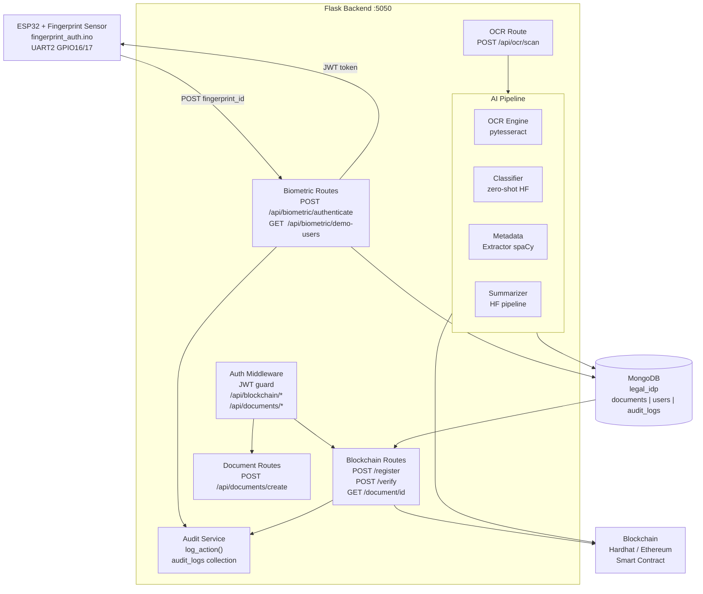

# Legal Document Management System — Documentation

---

## MODULE STATUS

| Module | Status |
|---|---|
| OCR Processing | ✓ Complete |
| Legal Document Classification | ✓ Complete |
| Metadata Extraction | ✓ Complete |
| Summarization | ✓ Complete |
| MongoDB Storage | ✓ Complete |
| Blockchain Registration | ✓ Complete |
| Blockchain Verification | ✓ Complete |
| ESP32 Fingerprint Authentication | ✓ Complete |
| JWT Authentication | ✓ Complete |
| Protected Routes | ✓ Complete |
| Audit Logging | ✓ Complete |
| Demo Users | ✓ Complete |

---

## PHASE 3 — SYSTEM ARCHITECTURE

### ASCII Diagram

```
┌─────────────────────────────────────────────────────────────┐
│                    LEGAL IDP SYSTEM                         │
└─────────────────────────────────────────────────────────────┘

  ┌──────────────────┐
  │  ESP32 + Finger- │
  │  print Sensor    │  ← Hardware (GPIO16/17, UART2, 57600 baud)
  │  fingerprint     │
  │  _auth.ino       │
  └────────┬─────────┘
           │ POST /api/biometric/authenticate
           │ {"fingerprint_id": 1}
           ▼
  ┌──────────────────────────────────────────────────────────┐
  │                  FLASK BACKEND (port 5050)               │
  │                                                          │
  │  ┌──────────────┐  ┌──────────────┐  ┌───────────────┐  │
  │  │  Biometric   │  │   Auth       │  │   Audit       │  │
  │  │  Routes      │  │   Middleware │  │   Service     │  │
  │  │  /api/       │  │  JWT guard   │  │  audit_logs   │  │
  │  │  biometric/  │  │  on /docs    │  │  collection   │  │
  │  │              │  │  /blockchain │  │               │  │
  │  └──────┬───────┘  └──────┬───────┘  └───────────────┘  │
  │         │                 │                              │
  │  ┌──────▼───────┐  ┌──────▼──────────────────────────┐  │
  │  │  OCR Route   │  │  Document & Blockchain Routes    │  │
  │  │  /api/ocr/   │  │  /api/documents/                 │  │
  │  │  scan        │  │  /api/blockchain/register        │  │
  │  └──────┬───────┘  │  /api/blockchain/verify          │  │
  │         │          │  /api/blockchain/document/<id>   │  │
  │         │          └──────┬──────────────────────────-┘  │
  │         │                 │                              │
  │  ┌──────▼───────────────┐ │                              │
  │  │   AI PIPELINE        │ │                              │
  │  │  ┌───────────────┐   │ │                              │
  │  │  │ OCR Engine    │   │ │                              │
  │  │  │ (pytesseract) │   │ │                              │
  │  │  ├───────────────┤   │ │                              │
  │  │  │ Classifier    │   │ │                              │
  │  │  │ (zero-shot)   │   │ │                              │
  │  │  ├───────────────┤   │ │                              │
  │  │  │ Metadata      │   │ │                              │
  │  │  │ Extractor     │   │ │                              │
  │  │  ├───────────────┤   │ │                              │
  │  │  │ Summarizer    │   │ │                              │
  │  │  └───────┬───────┘   │ │                              │
  │  └──────────┼───────────┘ │                              │
  └─────────────┼─────────────┼──────────────────────────────┘
                │             │
                ▼             ▼
  ┌─────────────────────────────────────────────────────────┐
  │                    MONGODB (legal_idp)                  │
  │  collections: documents │ users │ audit_logs            │
  └─────────────────────────┬───────────────────────────────┘
                            │
                            ▼
  ┌─────────────────────────────────────────────────────────┐
  │              BLOCKCHAIN (Hardhat / Ethereum)            │
  │  Smart contract: document hash registration             │
  │  Functions: registerDocument() / verifyDocument()       │
  └─────────────────────────────────────────────────────────┘
```

### Mermaid Diagram



---

## PHASE 4 — API DOCUMENTATION

### Biometric Endpoints

| Method | Endpoint | Purpose | Auth Required |
|---|---|---|---|
| POST | `/api/biometric/register` | Register a new user with fingerprint ID | No |
| POST | `/api/biometric/authenticate` | Authenticate by fingerprint ID, receive JWT | No |
| GET | `/api/biometric/profile` | Get user profile from JWT claims | Yes (Bearer) |
| GET | `/api/biometric/demo-users` | List demo users (name + role) | No |

**POST /api/biometric/authenticate**
```json
// Request
{ "fingerprint_id": 1 }

// Response 200
{ "token": "eyJhbGci...", "name": "Judge A", "role": "judge" }

// Response 404
{ "error": "Fingerprint not registered" }
```

**GET /api/biometric/demo-users**
```json
// Response 200
[
  { "name": "Judge A", "role": "judge" },
  { "name": "Police Officer", "role": "police" },
  { "name": "Lawyer", "role": "lawyer" }
]
```

---

### OCR Endpoint

| Method | Endpoint | Purpose | Auth Required |
|---|---|---|---|
| POST | `/api/ocr/scan` | Upload document, run full pipeline | No* |

*Note: Add to PROTECTED_PREFIXES to require JWT for uploads.

**POST /api/ocr/scan** (multipart/form-data)
```
file: <document.pdf / .png / .jpg>
lang: eng (optional)
```
```json
// Response 200
{
  "document_id": "64a1b2c3d4e5f6789012abcd",
  "document_type": "FIR",
  "summary": "FIR filed by complainant against accused...",
  "metadata": {
    "case_number": "CR/123/2024",
    "persons": ["John Doe", "Jane Smith"],
    "dates": ["01-Jan-2024"],
    "ipc_sections": ["Section 420"]
  },
  "blockchain": {
    "document_hash": "sha256:abc123...",
    "transaction_hash": "0xdef456...",
    "registered": true
  }
}
```

---

### Blockchain Endpoints

| Method | Endpoint | Purpose | Auth Required |
|---|---|---|---|
| POST | `/api/blockchain/register` | Register document hash on-chain | Yes (Bearer) |
| POST | `/api/blockchain/verify` | Verify document integrity | Yes (Bearer) |
| GET | `/api/blockchain/document/<id>` | Get on-chain record | Yes (Bearer) |

**POST /api/blockchain/verify**
```json
// Request
{ "document_id": "64a1b2c3d4e5f6789012abcd" }

// Response 200
{
  "document_id": "64a1b2c3d4e5f6789012abcd",
  "document_hash": "sha256:abc123...",
  "status": "authentic"
}
```

---

### Document Endpoints

| Method | Endpoint | Purpose | Auth Required |
|---|---|---|---|
| POST | `/api/documents/create` | Generate legal document from template | Yes (Bearer) |

---

## PHASE 5 — 5-MINUTE DEMO SCRIPT

---

### Step 1 — Fingerprint Authentication (0:00–0:45)

**Action:** Place enrolled finger on the sensor connected to ESP32.

**Expected Serial Monitor Output:**
```
[SENSOR] Match! ID=1  Confidence=150
[HTTP] POST http://192.168.0.16:5050/api/biometric/authenticate
[HTTP] Response code: 200
[HTTP] Response body: {"name":"Judge A","role":"judge","token":"eyJ..."}
```
**Point out:** JWT token issued. Only registered fingerprints get access.

---

### Step 2 — Try Protected Route Without Token (0:45–1:15)

**Action:** In Postman/curl, run:
```
GET http://localhost:5050/api/blockchain/document/test
(no Authorization header)
```

**Expected:**
```json
{ "error": "Authorization header missing or malformed" }
Status: 401
```
**Point out:** System blocks unauthenticated access.

---

### Step 3 — Document Upload & OCR (1:15–2:30)

**Action:** POST a FIR document to OCR endpoint with JWT:
```
POST http://localhost:5050/api/ocr/scan
Authorization: Bearer <token from Step 1>
Body: form-data, file = fir_sample.pdf
```

**Expected:**
```json
{
  "document_id": "...",
  "document_type": "FIR",
  "summary": "FIR filed against...",
  "metadata": { "case_number": "...", "persons": [...] },
  "blockchain": { "registered": true, "transaction_hash": "0x..." }
}
```
**Point out:** OCR → Classification → Metadata → Summary → Blockchain in one call.

---

### Step 4 — Blockchain Verification (2:30–3:15)

**Action:**
```
POST http://localhost:5050/api/blockchain/verify
Authorization: Bearer <token>
Body: { "document_id": "<id from Step 3>" }
```

**Expected:**
```json
{ "status": "authentic", "document_hash": "sha256:..." }
```
**Point out:** Hash recomputed from stored OCR text and matched against on-chain record.

---

### Step 5 — Demo Users & Role-Based Access (3:15–3:45)

**Action:**
```
GET http://localhost:5050/api/biometric/demo-users
```

**Expected:**
```json
[
  { "name": "Judge A", "role": "judge" },
  { "name": "Police Officer", "role": "police" },
  { "name": "Lawyer", "role": "lawyer" }
]
```

---

### Step 6 — Audit Log (3:45–4:30)

**Action:** Check MongoDB `audit_logs` collection:
```
db.audit_logs.find().sort({timestamp:-1}).limit(5)
```

**Expected:**
```json
[
  { "user": "Judge A", "role": "judge", "action": "verify_document", "document_id": "...", "timestamp": "..." },
  { "user": "Judge A", "role": "judge", "action": "login", "timestamp": "..." }
]
```
**Point out:** Every action is tracked — login, upload, view, verify.

---

### Step 7 — Invalid Token Test (4:30–5:00)

**Action:**
```
GET http://localhost:5050/api/blockchain/document/test
Authorization: Bearer invalidtoken
```

**Expected:**
```json
{ "error": "Invalid or expired token" }
Status: 401
```

---

## PHASE 6 — SCREENSHOT CHECKLIST

```
□ Fingerprint Authentication    — Serial Monitor: [SENSOR] Match! ID=1
□ JWT Response                  — {"token":"eyJ...", "name":"Judge A", "role":"judge"}
□ Upload Page                   — POST /api/ocr/scan → 200 with document_id
□ OCR Output                    — ocr_text.clean field in MongoDB document
□ Classification Result         — "document_type": "FIR" / "Court Judgment" / "Contract"
□ Metadata Extraction           — case_number, persons, dates, ipc_sections populated
□ Summary Output                — "summary": "FIR filed by..."
□ MongoDB Record                — db.documents.findOne() shows full document
□ Blockchain Transaction        — "transaction_hash": "0x..." in response
□ Verification Result           — {"status": "authentic"}
□ Audit Log                     — db.audit_logs.find() shows login, verify entries
```

---

## PHASE 7 — FINAL REPORT

### Test Results
```
TEST1_NO_TOKEN_401         : PASS  — 401 without Authorization header
TEST2_JWT_GENERATED        : PASS  — fingerprint_id=1 → JWT for Judge A
TEST3_PROTECTED_WITH_JWT   : PASS  — valid JWT passes middleware
TEST4_INVALID_TOKEN_401    : PASS  — tampered token → 401
TEST5_DEMO_USERS           : PASS  — 3 demo users returned
TEST6_AUDIT_LOGS           : PASS  — audit record written to MongoDB
```

### Files Modified / Created
```
CREATED : backend/services/audit_service.py
MODIFIED: backend/routes/biometric.py   — audit login, demo-users endpoint
MODIFIED: backend/routes/blockchain.py  — audit verify_document, view_document
MODIFIED: backend/app.py                — demo user seeding on startup
CREATED : backend/run_integration_tests.py
CREATED : SYSTEM_DOCUMENTATION.md
```

### Issues Found
```
⚠ JWT secret "change-me-in-production" is 23 bytes (below 32-byte minimum).
  Set JWT_SECRET env var before production deployment.

⚠ /api/ocr/scan is not JWT-protected.
  Add "/api/ocr/" to PROTECTED_PREFIXES in middleware/auth.py if uploads
  should require authentication.
```

### Final Readiness Score

```
SCORE         : 6/6 tests passed
READINESS     : 100%
STATUS        : READY FOR DEMO ✓
```
